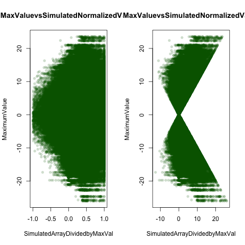
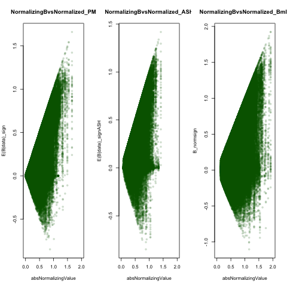
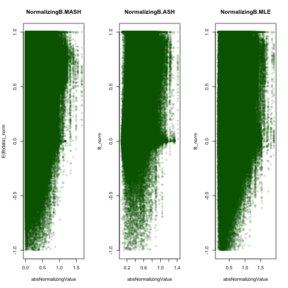
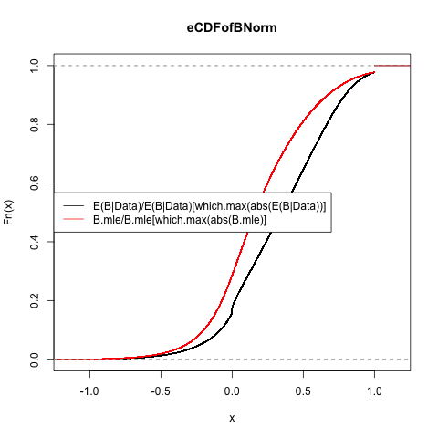

```{r setup, include=FALSE}

knitr::opts_chunk$set(cache=TRUE)
barfunc=function(genename){
  par(mfrow=c(1,2))
  t=genename
  name=strsplit(rownames(maxz)[t], "[.]")[[1]][1]
a=barplot(as.numeric(maxz[t,]),las=2,cex.names=0.5,main=paste0("Z Statistics",name),col=col.func.mle(qs$qvalues,z.stat = maxz,j = t),names=colnames(maxz))
legend("center",c("qval>0.5","0.5>qval>0.05","qval<0.05"),col=c("red","orange","green"),pch=20)
b=barplot(as.numeric(posterior.means[t,]),main=paste0("E(Z|EZ)",name),col=col.func(t,lfsr=lfsr,posterior.means=posterior.means),cex.names=0.5,las=2,ylab="PosteriorMean",names=colnames(posterior.means))
legend("center",c("lfsr>0.5","0.5>lfsr>0.05","lfsr<0.05"),col=c("red","orange","green"),pch=20)
}

het.norm=function(effectsize){
  t(apply(effectsize,1,function(x){
  x/x[which.max(abs(x))]
}))}

col.func=function(lfsr,posterior.means,j){
  R=ncol(posterior.means)
  lfsr.mat=as.matrix(lfsr)
  col.mat=NULL
  for(r in 1:R){
 if (lfsr.mat[j,r]<=0.05) {
      col.mat[r]="green"
    } else if (lfsr.mat[j,r]<0.5) {
      col.mat[r]="orange"
    } else if (lfsr.mat[j,r]>=0.50) {
      col.mat[r]="red"
    } 
  }
  return(col.mat)
}


col.func.mle=function(qvalues,z.stat,j){
  R=ncol(posterior.means)
  q.mat=as.matrix(qvalues)
  col.mat=NULL
  for(r in 1:R){
 if (q.mat[j,r]<=0.05) {
      col.mat[r]="green"
    } else if (q.mat[j,r]<0.5) {
      col.mat[r]="orange"
    } else if (q.mat[j,r]>=0.50) {
      col.mat[r]="red"
    } 
  }
  return(col.mat)
}


L2norm = function(x){return(sqrt(sum(x^2)))}

norm_effects = function(m,standardize=TRUE){
  max_pos = apply(m,1,max)
  max_neg = apply(-m,1,max)
  max_sign = ifelse(max_pos>max_neg, 1,-1) #find the sign of the largest effect
  if(standardize){max_sign=max_sign* apply(m,1,L2norm)}
  m/max_sign
}


plot_tc = function(lfsr,curvedata,thresh=0.05){

  ##create a matrix showing whether or not lfsr satisfies threshold
  sigmat = lfsr <= thresh;
  sigs=which(rowSums(sigmat)==44)
  iplotCurves(curvedata[sigs,],chartOpts=list(curves_xlab="Tissue",curves_ylab="T statistic"))
}  


plot_ts=function(tissuename,lfsr,curvedata,thresh=0.05,subset=1:44){
  index_tissue=which(colnames(lfsr) %in% tissuename);

  ##create a matrix showing whether or not lfsr satisfies threshold
  sigmat = lfsr <= thresh;
  sigs=which(rowSums(sigmat[,index_tissue,drop=FALSE])==length(tissuename) & rowSums(sigmat[,-index_tissue,drop=FALSE])==0)
  
   iplotCurves(curvedata[sigs,subset],chartOpts=list(curves_xlab="Tissue",curves_ylab="curvedata"))}


bi_plot_funcmaxz=function(max.val,znorm){
 a=rep.col(max.val,44)
  plot(znorm,a,main="MaxValuevsSimulatedNormalizedValue",xlab="SimulatedArrayDividedbyMaxVal",ylab="MaximumValue")
  }


```

ii) a specific suggestion for a  plot: for each of your sampled beta vectors, normalize beta_t by its “largest" element (where largest means largest in absolute value, but you normalize by the actual value, not the absolute value,  so that the normalized vector has maximum element +1). Then just plot a histogram of the resulting normalized beta values (pooled across all the samples). We should see very strong negative values are rare?

Here I use posterior means:

```{r echo=F}

lfsr=read.table("../Data/Aug13withEDlfsr.txt")[,-1]
posterior.means=read.table("../Data/Aug13withEDposterior.means.txt")[,-1]
post.weights=read.table("~/Dropbox/Aug12/Aug13withEDpost.weights.txt")[,-1]

posterior.betas=read.table("../Data/Aug13withEDposterior.betas.txt")
maxbetas=read.table("../Data/maxbetahats.txt")

z.stat=read.table("../Data/maxz.txt")
maxz=z.stat
covmat=readRDS("../Data/covmatAug13withED.rds")
eznorm=het.norm(effectsize = posterior.means)
ebnorm=het.norm(effectsize=posterior.betas)


znorm=het.norm(effectsize = z.stat)
bnorm=het.norm(effectsize = maxbetas)

p.vals=t(apply(z.stat,1,function(x){2*(1-pnorm(abs(x)))}))
library('qvalue')
qs=qvalue(p.vals)
```

```{r}
sum(ebnorm>0)/length(ebnorm)
sum(eznorm>0)/length(eznorm)

znorm=het.norm(effectsize = z.stat)
sum(znorm>0)/length(znorm)
sum(bnorm>0)/length(bnorm)
```

```{r plothistogram}
par(mfrow=c(1,2))
hist(as.vector(unlist(eznorm)),main="E(Z|Data)/E(Z|Data)[max(abs(E(Z|Data))]",freq=F,xlab="E(Z|Data)/E(Z|Data)[max(abs(E(Z|Data))]",ylim=c(0,2),nclass=100)
hist(as.vector(unlist(znorm)),main="Z/Z[max(abs(Z)]",freq=F,xlab="Z/Z[max(abs(Z)]",ylim=c(0,2),nclass=100)


par(mfrow=c(1,2))
hist(as.vector(unlist(ebnorm)),main="E(B|Data)/E(B|Data)[max(abs(E(B|Data))]",freq=F,xlab="E(B|Data)/E(B|Data)[max(abs(E(B|Data))]",ylim=c(0,2),nclass=100)
hist(as.vector(unlist(bnorm)),main="B/B[max(abs(B)]",freq=F,xlab="B/B[max(abs(B)]",ylim=c(0,2),nclass=100)

het.func=function(normdat,threshold){
  apply(normdat,1,function(x){sum(x<threshold)})}


plot(density(het.func(ebnorm,threshold=0.2)),main="Number of Tissues in which B.norm<alpha*MaxB",xlab="NumberofTissues",ylim=c(0,0.2),xlim=c(0,43))
lines(density(het.func(ebnorm,threshold=0.3)),col="green")
lines(density(het.func(ebnorm,threshold=0.4)),col="blue")
lines(density(het.func(ebnorm,threshold=0.5)),col="red")
lines(density(het.func(ebnorm,threshold=0.6)),col="purple")
lines(density(het.func(ebnorm,threshold=0.7)),col="orange")
legend("center",col=c("black","green","blue","red","purple","orange"),legend=c("alpha=0.2","alpha=0.3","alpha=0.4","alpha=0.5","alpha=0.6","alpha=0.7"),lty=1)
```

Now, we might want to plot a biplot of these values vs the value used to normalize it:

```{r biplot,eval=FALSE}
R=ncol(posterior.means)
maxes=t(apply(posterior.means,1,function(x){
  rep(x[which.max(abs(x))],R)
}))


max.mle=t(apply(maxz,1,function(x){
  rep(x[which.max(abs(x))],R)
}))

png("normstuffez.png")
par(mfrow=c(1,2))
plot(abs(maxes),eznorm,main="NormalizingZvsNormalized_PM",xlab="absNormalizingValue",ylab="E(Z|data)_norm", 
     col=rgb(0,100,0,50,maxColorValue=255), pch=16)

plot(abs(max.mle),znorm,,main="NormalizingZvsNormalized_Zmle",ylab="Z_norm",xlab="absNormalizingValue",col=rgb(0,100,0,50,maxColorValue=255), pch=16)

dev.off()

png("normstuffez_sign.png")
par(mfrow=c(1,2))
plot(abs(maxes),ezsign,main="NormalizingZvsNormalized_PM",xlab="absNormalizingValue",ylab="E(Z|data)_norm", 
     col=rgb(0,100,0,50,maxColorValue=255), pch=16)

plot(abs(max.mle),zsign,main="NormalizingZvsNormalized_Zmle",ylab="Z_norm",xlab="absNormalizingValue",col=rgb(0,100,0,50,maxColorValue=255), pch=16)
dev.off()


maxes=t(apply(posterior.betas,1,function(x){
  rep(x[which.max(abs(x))],R)
}))

max.mle=t(apply(maxb,1,function(x){
  rep(x[which.max(abs(x))],R)
}))

png("normstuffeb.png")
par(mfrow=c(1,2))
plot(abs(maxes),ebnorm,main="NormalizingBvsNormalized_PM",xlab="absNormalizingValue",ylab="E(B|data)_norm", 
     col=rgb(0,100,0,50,maxColorValue=255), pch=16)
plot(abs(max.mle),bnorm,main="NormalizingBvsNormalized_Zmle",ylab="B_norm",xlab="absNormalizingValue",col=rgb(0,100,0,50,maxColorValue=255), pch=16)
dev.off()

png("normstuffeb_sign.png")
par(mfrow=c(1,2))
plot(abs(maxes),ebsign,main="NormalizingBvsNormalized_PM",xlab="absNormalizingValue",ylab="E(B|data)_sign", 
     col=rgb(0,100,0,50,maxColorValue=255), pch=16)
plot(abs(max.mle),bsign,main="NormalizingBvsNormalized_Zmle",ylab="B_normsign",xlab="absNormalizingValue",col=rgb(0,100,0,50,maxColorValue=255), pch=16)
dev.off()


png("ecdf.png")
e=ecdf(ebnorm)
plot(e,main="eCDFofBNorm")
lines(ecdf(bnorm),col="red")
legend("left",lty=1,col=c("black","red"),legend=c("E(B|Data)/E(B|Data)[which.max(abs(E(B|Data))]","B.mle/B.mle[which.max(abs(B.mle)]"))
dev.off()


```

ii) as in ii) but normalize just by sign of largest element, rather than largest element. (that is, we just flip each beta vector so the largest element is positive). Again we don’ t expect to see large negative values. This preserves information about absolute size of beta, not just relative size.

```{r sim.by.sign}

het.sign=function(effectsize){
  t(apply(effectsize,1,function(x){
  x/sign(x[which.max(abs(x))])
}))}


ezsign=het.sign(effectsize = posterior.means)
zsign=het.sign(effectsize = z.stat)

ebsign=het.sign(effectsize = posterior.betas)
bsign=het.sign(effectsize = maxbetas)

par(mfrow=c(1,2))
hist(as.vector(unlist(ezsign)),main="E(Z|Data)/sign(E(Z|Data)[max(abs(E(Z|Data))])",freq=F,xlab="E(Z|Data)/sign(E(Z|Data)[max(abs(E(Z|Data))])",ylim=c(0,0.4))
hist(as.vector(unlist(zsign)),main="Z/Z[max(abs(Z)]",freq=F,xlab="Z/sign(Z[max(abs(Z)])",ylim=c(0,0.4))


par(mfrow=c(1,2))
hist(as.vector(unlist(ebsign)),main="E(B|Data)/sign(E(B|Data)[max(abs(E(B|Data))])",freq=F,xlab="E(B|Data)/sign(E(B|Data)[max(abs(E(B|Data))])")
hist(as.vector(unlist(bsign)),main="B/B[max(abs(B)]",freq=F,xlab="B/sign(B[max(abs(B)])",ylim=c(0,4))
```


```{r simulations,eval=FALSE,echo=FALSE}
sim.all = 
  function(j,b.j.hat,se.j.hat,covmat,pis,sim){
K=length(covmat)
b.mle=as.vector(t(b.j.hat[j,]))##turn i into a R x 1 vector
V.j.hat=diag(se.j.hat[j,]^2)
lik=lik.func(b.mle,V.j.hat,covmat)
post.weights=lik*pis/sum(lik*pis)
component=apply(rmultinom(sim,1,prob = post.weights),2,function(x){which(x==1)})##choose a componenet according to responsibility
tinv=lapply(seq(1:sim),function(sim){k=component[sim];solve(covmat[[k]]+V.j.hat)})##generate a list of inverted Ks for all the simulations
b.j.=lapply(seq(1:sim),function(sim){ k=component[sim];post.b.jk.ed.mean(b.mle,tinv=tinv[[sim]],covmat[[k]])})##for each component, compute posterior mean
B.j.=lapply(seq(1:sim),function(sim){ k=component[sim];post.b.jk.ed.cov(tinv=tinv[[sim]],covmat[[k]])})## a list of posterior covariances
 #and ask if they are either all pos or all neg
max.val=rep(0,sim)
sim.norm=matrix(nrow=sim,ncol=R)
sim.norm.sign=matrix(nrow=sim,ncol=R)
for(x in seq(1:sim)){
dat=mvrnorm(1,mu = b.j.[[x]],Sigma = B.j.[[x]],tol = 10)##for each simulation, generate a multivariate normal
sim.norm[x,]=dat/dat[which.max(abs(dat))]##for each simulation, normalize by maxval in abs terms
sim.norm.sign[x,]=dat/sign(dat[which.max(abs(dat))])##for each simulation, normalize by sign of maxval in abs terms
max.val[x]=dat[which.max(abs(dat))]}
return(list(sim.norm=sim.norm,component=component,max.val=max.val,sim.norm.sign=sim.norm.sign))}


a=array(dim=c(J,sim,R))
b=array(dim=c(J,sim,R))
component=matrix(nrow=J,ncol=sim)
max.val=matrix(nrow=J,ncol=sim)
for(j in 1:J){
  s=sim.all(j,b.j.hat=betahat,sebetahat,covmat,pis,sim)
  a[j,,]=s$sim.norm
  b[j,,]=s$sim.norm.sign
  component[j,]=s$component
  max.val[j,]=s$max.val
  
}

saveRDS(a,"simulatedmvnnormalized.rds")
saveRDS(b,"simulatedmvnsign.rds")
saveRDS(component,"simulatedcomponent.rds")
saveRDS(max.val,"simulatedmaxval.rds")
```

Thresholding:

vi) we want to avoid pitfalls of thresholding. However, as long as we keep these pitfalls in mind it might be useful to give numbers from thresholding. (eg that histogram we made that showed how many tissues each eQTL was “significant” in)

```{r number of tissues, echo=FALSE}
thresh=0.05
sigmat=(lfsr<=thresh)
nsig= rowSums(sigmat)
hist(nsig[nsig>0],main="Number of tissues in which eQTl significant", nclass=45,xlab="Number of tissues")
```


For each of your sampled beta vectors, normalize beta_t by its “largest" element (where largest means largest in absolute value, but you normalize by the actual value, not the absolute value,  so that the normalized vector has maximum element +1). Then just plot a histogram of the resulting normalized beta values (pooled across all the samples). We should see very strong negative values are rare?
```{r hetsim}
hetaugust=readRDS("~/Dropbox/Aug12/simulatedmvnnormalized.rds")
max.val=readRDS("~/Dropbox/Aug12/simulatedmaxval.rds")
par(mfrow=c(1,2))
hist(unlist(as.vector(hetaugust)),main="Simulated_Z/Z[,which.max(abs(Z))]",xlab="Znorms_simulatedfromPosterior",freq=F,ylim=c(0,1.5))
hist(unlist(as.vector(znorm)),main="Z/Z[,which.max(abs(Z))]",xlab="Znorm",freq=F,ylim=c(0,1.5))    
```

Here, we divide by the maximum sign value.
```{r hetsimsign}
hetaugust=readRDS("~/Dropbox/Aug12/simulatedmvnsign.rds")
par(mfrow=c(1,2))
hist(unlist(as.vector(hetaugust)),main="Simulated_Z/Z[,which.max(abs(Z))]",xlab="Znorms_simulatedfromPosterior",freq=F,ylim=c(0,.5))


hist(unlist(as.vector(zsign)),main="Z/sign(Z[,which.max(abs(Z))])",xlab="Znorm",freq=F,ylim=c(0,0.5))    
```

Biplots of simulated values:

```{r}

rep.col<-function(x,n){
   matrix(rep(x,each=n), ncol=n, byrow=TRUE)
}

bi_plot_funct=function(sim,max.val,sim.array){
  j=sim
  mat.col=max.val[,j]
  a=rep.col(max.val[,j],44)
  plot(sim.array[,j,],a,main="MaxValuevsSimulatedNormalizedValue",xlab="SimulatedArrayDividedbyMaxVal",ylab="MaximumValue",col=rgb(0,100,0,50,maxColorValue=255), pch=16)
  }


```

For each simulation, we can make a biplot against the rvalue used to normalize the vector (the maxval).

```{r biplotmake}
hetsign=readRDS("~/Dropbox/Aug12/simulatedmvnsign.rds")
hetval=readRDS("~/Dropbox/Aug12/simulatedmvnnormalized.rds")
sum(hetsign>0)/length(hetsign)
sum(hetval>0)/length(hetval)

sum(znorm>0)/length(znorm)

```


```{r eval=F}
png("simulatedvsmax.png")
par(mfrow=c(1,2))
bi_plot_funct(sim=5,max.val = max.val,sim.array=hetval)
bi_plot_funct(sim=5,max.val = max.val,sim.array=hetsign)

dev.off()

z.max=apply(z.stat,1,function(x){x[which.max(abs(x))]})

png("mlevsmax.png")
par(mfrow=c(1,2))
bi_plot_funcmaxz(max.val=z.max,znorm = zsign)
bi_plot_funcmaxz(max.val=z.max,znorm = znorm)
dev.off()


```




Understanding patterns of sharing:

```{r evaluations, echo=F}
rownames(posterior.means)=rownames(maxz)
colnames(posterior.means)=colnames(maxz)

rownames(lfsr)=rownames(maxz)
colnames(lfsr)=colnames(maxz)


pis=readRDS("../Data/pisAug13withED.rds")$pihat


pi.mat=matrix(pis,ncol=54,byrow=T)
par(mfrow=c(1,2))
barplot(t(as.matrix(colSums(pi.mat))),names=c((paste0("K",seq(1:54)))),las=2,cex.names=0.5,main="PiHat")

num.mat=matrix(seq(1:length(covmat)),ncol=54,byrow=TRUE)
#num.mat=matrix(seq(1:1188),ncol=54,byrow=TRUE)
omegas=round(sapply(num.mat[,1],function(x){covmat[[x]][1]}),3)
barplot(t(as.matrix(rowSums(pi.mat))),las=2,cex.names=0.5,main="PiHat",names=omegas,xlab="Omega")
```

We can see that the majority of weight is on the non-single rank $U_ks$. In fact, the third $U_k$ which corresponds to the rank `r qr(covmat[[3]])$rank`.

```{r, heterogeneity distribution2}

barplot(diag(covmat[[num.mat[22,3]]])/max(diag(covmat[[num.mat[22,3]]])),main="Prior Effect Size Sigma per Tissue of Most Common Covariance Matrix",names=colnames(z.stat),las=2,cex.names=0.5)
```

Even though the sqrt(maximum$\omega$)is only 7, this captures the vast majority (over 95%) of the data, if we follow the principle that the max($\omega$) should be roughly $se(z)$^2+$z^2$.

```{r, heterogeneity distribution1}
dir=
heterogeneity=read.table("../Data/het.tablewithED.txt")[,1]
hist(heterogeneity,main="Proportion of Simulations with H0 False",freq=FALSE,xlab="Proportion of Simulations with Sign Heterogeneity")
sum(heterogeneity)
h=which(heterogeneity>0.5)
c=which(heterogeneity<0.5)
length(h)
length(c)
summary(unlist(as.vector(lfsr[h,])))
summary(unlist(as.vector(lfsr[c,])))

par(mfrow=c(1,2))
hist(unlist(as.vector(lfsr[h,])),main=NULL,ylab=NULL,xlab=NULL,freq=FALSE,ylim=c(0,14))

title(main="LFSRs of Inconsistent genes", col.main="red", 
   col.sub="blue", 
 	xlab="LFSR", ylab="Density",
  col.lab="green", cex.lab=0.75,ylim=c(0,14))

hist(unlist(as.vector(lfsr[c,])),main=NULL,ylab=NULL,xlab=NULL,freq=FALSE)

title(main="LFSRs of Consistent genes", col.main="red", 
 col.sub="blue", 
   xlab="LFSR", ylab="Density",
  col.lab="green", cex.lab=0.75)

```

But we can see that the lfsrs of the heterogeneous SNPs are consistency larger than the lfsrs of the consistent SNP, meaning that our model will alert us to their uncertainty.


Now, for each QTL I want to examine the posterior means of the tissues in which it was 'active' (at an lfsr threshold) and find QTL whose sign differed in at least 2 significant QTL. We restrict our analysis to only those gene snp pairs who show significance in at least one tissue:

```{r,show one significnat}
l=apply(lfsr,1,function(x){sum(x<0.05)})
sum(l!=0)
```

Here we can see that is `r sum(l!=0)' genes. 
Then we look to see if the posterior means differed in sign.

Now, for each QTL I want to examine the posterior means of the tissues in which it was 'active' (at an lfsr threshold) and find QTL whose sign differed in at least 2 significant QTL.
```{r, heterogeneity by threshold}
thresh=0.05
s=sapply(seq(1:nrow(posterior.betas)),function(x){
l=lfsr[x,];p=posterior.means[x,];plow=p[which(l<thresh)];##grab only those posterior means that are 'significant'
if(length(plow)==0){return("FALSE")}##for ones who show no significants, they can't be heterogenous
else{pos=sum(plow>0);neg=sum(plow<0);pos*neg!=0}})
sum(s=="TRUE")
hets=which(s=="TRUE")

###Now do it for univariate Z statistics

thresh=0.05
z=sapply(seq(1:nrow(maxz)),function(x){
l=lfsr[x,];p=z.stat[x,];plow=p[which(l<thresh)];##grab only those posterior means that are 'significant'
if(length(plow)==0){return("FALSE")}##for ones who show no significants, they can't be heterogenous
else{pos=sum(plow>0);neg=sum(plow<0);pos*neg!=0}})
sum(z=="TRUE")
hets=which(z=="TRUE")


```

Now, for each snp, simulate 100 draws from mvnorm according to posterior weights; count proportion of times signs differ. This takes about 2 hours .

```{r,echo=TRUE,eval=FALSE}
heterogeneity=sapply(seq(1:nrow(maxz)),function(j){sim.array.generation(j,b.j.hat=maxz,s.j,covmat,pis,sim=100)})
write.table(heterogeneity,"heterogeneityindex.txt",row.names=rownames(maxz))
```

We can examine the distribution of heterogeneity.
```{r, heterogeneity distribution}
heterogeneity=read.table("../Data/het.tablewithED.txt")[,1]
hist(heterogeneity,main="Proportion of Simulations with H0 False",freq=FALSE,xlab="Proportion of Simulations with Sign Heterogeneity")
sum(heterogeneity)
```

If we compare with original z statistics:

```{r}
zhets=apply(z.stat,1,function(dat){pos=sum(dat>0);neg=sum(dat<0);pos*neg!=0})
sum(zhets)
sum(zhets)/length(zhets)
```
