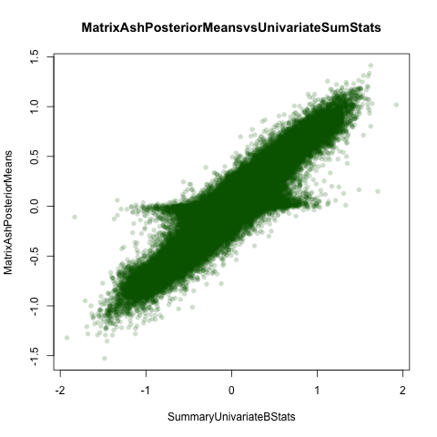
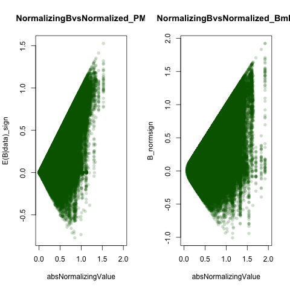
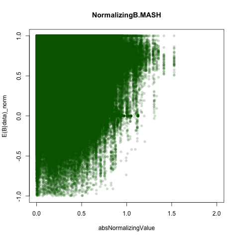
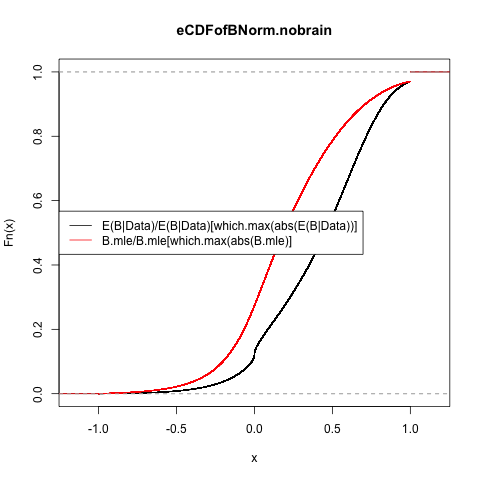
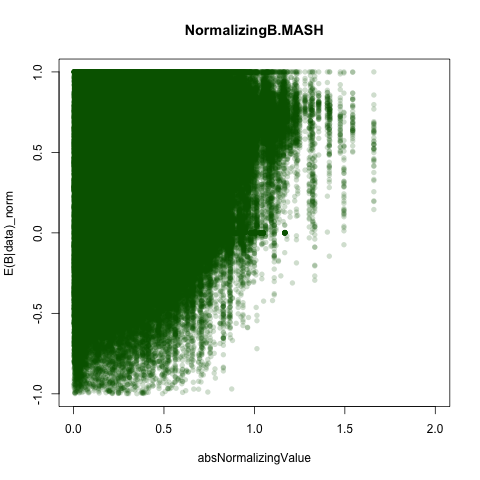

```{r load data}

knitr::opts_chunk$set(cache=TRUE)
covmat=readRDS("../withoutbrain/covmatnobrain.rds")
pis=readRDS("../withoutbrain/pisnobrain.rds")$pihat
z.stat=read.table("../Data/maxz.txt")[,-c(7:16)]
pi.mat=matrix(pis,ncol=44,byrow=T)
lfsr.mash=read.table("../withoutbrain/nobrainlfsr.txt")[,-1]
pm.mash=read.table("../withoutbrain//nobrainposterior.means.txt")[,-1]
standard.error=read.table("../Data/standard.error.txt")[,-c(7:16)]
pm.mash.beta=pm.mash*standard.error

pm.ash=read.table("../Comparison with Univariate Ash/univariate.ash.pm.txt")[,-c(7:16)]
lfsr.ash=read.table("../Comparison with Univariate Ash/univariate.ash.lfsr.txt")[,-c(7:16)]
pm.ash.beta=pm.ash*standard.error

colnames(lfsr.mash)=colnames(pm.mash)=colnames(pm.mash.beta)=colnames(z.stat)

barfunc=function(genename){
  par(mfrow=c(1,2))
  t=genename
  name=strsplit(rownames(maxz)[t], "[.]")[[1]][1]
a=barplot(as.numeric(maxz[t,]),las=2,cex.names=0.5,main=paste0("Z Statistics",name),col=col.func.mle(qs$qvalues,z.stat = maxz,j = t),names=colnames(maxz))
legend("center",c("qval>0.5","0.5>qval>0.05","qval<0.05"),col=c("red","orange","green"),pch=20)
b=barplot(as.numeric(posterior.means[t,]),main=paste0("E(Z|EZ)",name),col=col.func(t,lfsr=lfsr,posterior.means=posterior.means),cex.names=0.5,las=2,ylab="PosteriorMean",names=colnames(posterior.means))
legend("center",c("lfsr>0.5","0.5>lfsr>0.05","lfsr<0.05"),col=c("red","orange","green"),pch=20)
}

het.norm=function(effectsize){
  t(apply(effectsize,1,function(x){
  x/x[which.max(abs(x))]
}))}


sign.norm=function(effectsize){
  t(apply(effectsize,1,function(x){
  x/sign(x[which.max(abs(x))])
}))}

col.func=function(lfsr,posterior.means,j){
  R=ncol(posterior.means)
  lfsr.mat=as.matrix(lfsr)
  col.mat=NULL
  for(r in 1:R){
 if (lfsr.mat[j,r]<=0.05) {
      col.mat[r]="green"
    } else if (lfsr.mat[j,r]<0.5) {
      col.mat[r]="orange"
    } else if (lfsr.mat[j,r]>=0.50) {
      col.mat[r]="red"
    } 
  }
  return(col.mat)
}


col.func.mle=function(qvalues,z.stat,j){
  R=ncol(posterior.means)
  q.mat=as.matrix(qvalues)
  col.mat=NULL
  for(r in 1:R){
 if (q.mat[j,r]<=0.05) {
      col.mat[r]="green"
    } else if (q.mat[j,r]<0.5) {
      col.mat[r]="orange"
    } else if (q.mat[j,r]>=0.50) {
      col.mat[r]="red"
    } 
  }
  return(col.mat)
}


L2norm = function(x){return(sqrt(sum(x^2)))}

norm_effects = function(m,standardize=TRUE){
  max_pos = apply(m,1,max)
  max_neg = apply(-m,1,max)
  max_sign = ifelse(max_pos>max_neg, 1,-1) #find the sign of the largest effect
  if(standardize){max_sign=max_sign* apply(m,1,L2norm)}
  m/max_sign
}


plot_tc = function(lfsr,curvedata,thresh=0.05){

  ##create a matrix showing whether or not lfsr satisfies threshold
  sigmat = lfsr <= thresh;
  sigs=which(rowSums(sigmat)==44)
  iplotCurves(curvedata[sigs,],chartOpts=list(curves_xlab="Tissue",curves_ylab="T statistic"))
}  


plot_ts=function(tissuename,lfsr,curvedata,thresh=0.05,subset=1:44){
  index_tissue=which(colnames(lfsr) %in% tissuename);

  ##create a matrix showing whether or not lfsr satisfies threshold
  sigmat = lfsr <= thresh;
  sigs=which(rowSums(sigmat[,index_tissue,drop=FALSE])==length(tissuename) & rowSums(sigmat[,-index_tissue,drop=FALSE])==0)
  
   iplotCurves(curvedata[sigs,subset],chartOpts=list(curves_xlab="Tissue",curves_ylab="curvedata"))}

plot_singletontissues=function(lfsr,thresh,method){
  
sigs=as.matrix(lfsr)<=thresh

ones=which(rowSums(sigs)==1)
barplot(apply(lfsr[which(rowSums(lfsr<=thresh)==1),],2,function(x){sum(x<=thresh)}),las=2,cex.names=0.5,main=paste0("Number of eQTL with",method,"<0.05 in Single Tissue"),ylim=c(0,620))
}

```

Let's plot singletons:

```{r}
thresh=0.05
plot_singletontissues(lfsr.mash,thresh,method="MATRIXASH")
maxb=read.table("../Data/maxbetahats.txt")[,-c(7:16)]


png("comparebeta.png")
plot(unlist(as.vector(maxb)),unlist(as.vector(pm.mash.beta)),col=rgb(0,100,0,50,maxColorValue=255), pch=16,main="MatrixAshPosteriorMeansvsUnivariateSumStats",xlab="SummaryUnivariateBStats",ylab="MatrixAshPosteriorMeans")
dev.off()

```

```{r includeimage,echo=FALSE}
getwd()

```
We can consider the number of statistics at each threshold using both methods:

```{r}
thresh=0.05
sum(lfsr.mash<thresh)
```

Let's also count how many associations we might count as inconsistent by simply counting the number of times the signs differed in a vector of posterior means for a given gene snp pair. This changes without brain, as with brain, there were 9597 inconsistent instances.

```{r}

inconsistent.func=function(posterior.means,lfsr,thresh=0.05){
h=apply(posterior.means,1,function(p){
  pos=sum(p>0);neg=sum(p<0);pos*neg!=0})
sum(h=="TRUE")}
inconsistent.func(pm.mash.beta,lfsr.mash)
inconsistent.func(pm.ash.beta,lfsr.mash)
```


If we restrict our analysis to only those considered significant at an lfsr threshold using ash computed LFSR, we have a smaller number, but this is simply because so many fewer associations are called significant using ash. Using the MASH lfsrs, the results are identical to using the univariate z statistics. WE can compare to the matrix ash posterior means as well. This was 3180 (roughtly 20% of the genes) when using Brains.

```{r}
 thresh=0.05


z=sapply(seq(1:nrow(pm.mash.beta)),function(x){
l=lfsr.mash[x,];p=pm.mash.beta[x,];plow=p[which(l<thresh)];##grab only those posterior means that are 'significant'
if(length(plow)==0){return("FALSE")}##for ones who show no significants, they can't be heterogenous
else{pos=sum(plow>0);neg=sum(plow<0);pos*neg!=0}})
sum(z==TRUE)
```

We can also consider a histogram of normalized posterior means and compute how often there is consistency in sign.

```{r}
maxb=read.table("../Data/maxbetahats.txt")[,-c(7:16)]

bnorm=het.norm(effectsize = maxb)
sum(bnorm>0)/length(bnorm)

matrix.ash.norm=het.norm(effectsize = pm.mash.beta)
sum(matrix.ash.norm>0)/length(matrix.ash.norm)

uni.ash.norm=het.norm(effectsize = pm.ash.beta)
sum(uni.ash.norm>0)/length(matrix.ash.norm)

pm.mash.beta.brain=read.table("../Data//Aug13withEDposterior.betas.txt")
matrix.ash.norm.brain=het.norm(effectsize = pm.mash.beta.brain)
sum(matrix.ash.norm.brain>0)/length(matrix.ash.norm.brain)

ash.norm=het.norm(effectsize = pm.ash.beta)


```


We might also be interested in the proportion that are greater than a particular threshold of max effect. This 
```{r by threshold}
sum(bnorm>0.5)/length(bnorm)

sum(uni.ash.norm>0.5)/length(bnorm)

sum(matrix.ash.norm>0.5)/length(matrix.ash.norm)

sum(matrix.ash.norm.brain>0.5)/length(matrix.ash.norm.brain)
```

Now, let's plot:
```{r}
par(mfrow=c(1,3))

hist(matrix.ash.norm,freq=FALSE,ylim=c(0,5),nclass=100,main="B_jr|Data/B_jr[which.max(abs(B_jr|Data))],MASHNOBRAIN")
legend("left",legend=paste0("mash.norm<0=",round((sum(matrix.ash.norm<0)/length(matrix.ash.norm)),3)))
hist(matrix.ash.norm.brain,freq=FALSE,ylim=c(0,5),nclass=100,main="WITHBRAIN,MASH")
legend("left",legend=paste0("mash.norm<0=",round((sum(matrix.ash.norm.brain<0)/length(matrix.ash.norm.brain)),3)))
hist(bnorm,freq=FALSE,ylim=c(0,5),nclass=100,main="B_jr|Data/B_jr[which.max(abs(B_jr|Data))],B_raw")
legend("left",legend=paste0("b.norm<0=",round((sum(bnorm<0)/length(matrix.ash.norm)),3)))


mash.sign=sign.norm(effectsize = pm.mash.beta)
mash.sign.brain=sign.norm(effectsize = pm.mash.beta.brain)

b.sign=sign.norm(effectsize = maxb)

par(mfrow=c(1,3))
hist(mash.sign,freq=FALSE,ylim=c(0,10),main="B_jr|Data/sign(B_jr[which.max(abs(B_jr|Data))],MASH",nclass=50)
legend("left",legend=paste0("mash.sign<0=",round((sum(matrix.ash.norm<0)/length(matrix.ash.norm)),3)))
hist(mash.sign.brain,freq=FALSE,ylim=c(0,10),main="WITHBRAIN,MASH",nclass=50)
legend("left",legend=paste0("mash.sign<0=",round((sum(matrix.ash.norm.brain<0)/length(matrix.ash.norm.brain)),3)))
hist(b.sign,freq=FALSE,ylim=c(0,10),main="B_jr|Data/sign(B_jr[which.max(abs(B_jr|Data))],Z.raw)",nclass=50)
legend("left",legend=paste0("z.sign<0=",round((sum(bnorm<0)/length(bnorm)),3)))

```


Understandably, there are no examples in which the sign of the posterior mean using univariate ash is flipped because there is no sharing of information across tissues, while with matrix ash, the sign changes about 18% of the time:

```{r comparing signs}
b.stat=maxb
sum2=b.stat*pm.mash.beta
sum(sum2<0)/length(unlist(sum2))
```

Let's consider the biplots of the values vs their maximums:
First, I plot the biplot of the Maximum values vs their Normalized using Posterior means computed with matrix ash, univariate ash, and univariate summary statistics.











```{r, eval=FALSE}
R=ncol(pm.mash.beta)
colnames(pm.mash.beta)=colnames(maxb)

max.mash=t(apply(pm.mash.beta,1,function(x){
  rep(x[which.max(abs(x))],R)
}))

max.mle=t(apply(maxb,1,function(x){
  rep(x[which.max(abs(x))],R)
}))

max.mash.brain=t(apply(pm.mash.beta.brain,1,function(x){
  rep(x[which.max(abs(x))],44)
}))


png("../Figures/normstuffeb_nobrain.png")
#par(mfrow=c(1,2))
plot(abs(max.mash),matrix.ash.norm,main="NormalizingB.MASH",xlab="absNormalizingValue",ylab="E(B|data)_norm", 
     col=rgb(0,100,0,50,maxColorValue=255), pch=16,xlim=c(0,2))
#plot(abs(max.mle),bnorm,main="NormalizingB.MLE",ylab="B_norm",xlab="absNormalizingValue",col=rgb(0,100,0,50,maxColorValue=255), pch=16,xlim=c(0,2))
dev.off()


png("../Figures/normstuffeb_brain.png")
par(mfrow=c(1,1))
plot(abs(max.mash.brain),matrix.ash.norm.brain,main="NormalizingB.MASH",xlab="absNormalizingValue",ylab="E(B|data)_norm", 
     col=rgb(0,100,0,50,maxColorValue=255), pch=16,xlim=c(0,2))
#plot(abs(max.mle),bnorm,main="NormalizingB.MLE",ylab="B_norm",xlab="absNormalizingValue",col=rgb(0,100,0,50,maxColorValue=255), pch=16,xlim=c(0,2))
dev.off()


png("../Figures/normstuffeb_sign_nobrain.png")
par(mfrow=c(1,2))
plot(abs(max.mash),mash.sign,xlim=c(0,2),main="NormalizingBvsNormalized_PM",xlab="absNormalizingValue",ylab="E(B|data)_sign", 
     col=rgb(0,100,0,50,maxColorValue=255), pch=16)
plot(abs(max.mle),b.sign,main="NormalizingBvsNormalized_Bmle",ylab="B_normsign",xlim=c(0,2),xlab="absNormalizingValue",col=rgb(0,100,0,50,maxColorValue=255), pch=16)
dev.off()


png("../Figures/ecdf_nobrain.png")
e=ecdf(matrix.ash.norm)
plot(e,main="eCDFofBNorm.nobrain")
lines(ecdf(het.norm(b.stat[,-c(7:16)])),col="red")

legend("left",lty=1,col=c("black","red"),legend=c("E(B|Data)/E(B|Data)[which.max(abs(E(B|Data))]","B.mle/B.mle[which.max(abs(B.mle)]"))
dev.off()

png("../Figures/ecdf_brain.png")
e=ecdf(matrix.ash.norm.brain)
plot(e,main="eCDFofBNorm.brain")
lines(ecdf(het.norm(b.stat)),col="red")
legend("left",lty=1,col=c("black","red"),legend=c("E(B|Data)/E(B|Data)[which.max(abs(E(B|Data))]","B.mle/B.mle[which.max(abs(B.mle)]"))
dev.off()

```

And finally, we can compare the magnitude heterogeneity - that is, the number of tissues in which the eQTL has an activity greater than $\alpha$ or (less than $\alpha$) of the maximum effect.


```{r}
het.func=function(normdat,threshold){
  apply(abs(normdat),1,function(x){sum(x<threshold)})}

ebnorm=matrix.ash.norm

hist(het.func(ebnorm,threshold=0.2),main="Number of Tissues in which B.norm<alpha*MaxB",xlab="NumberofTissue",nclass=35,col="blue")
#lines(table(het.func(ebnorm,threshold=0.3)),col="green")
#lines(table(het.func(ebnorm,threshold=0.4)),col="blue")
lines(table(het.func(ebnorm,threshold=0.5)),col="red")
#lines(table(het.func(ebnorm,threshold=0.6)),col="purple")
#lines(table(het.func(ebnorm,threshold=0.7)),col="orange")
legend("center",col=c("blue","red"),legend=c("alpha=0.2","alpha=0.5"),lty=1)


het.func=function(normdat,threshold){
  apply(abs(normdat),1,function(x){sum(x>threshold)})}


hist((het.func(ebnorm,threshold=0.5)),main="Number of Tissues in which B.norm>alpha*MaxB",xlab="NumberofTissues",nclass=30,col="blue",freq=FALSE)
#lines(table(het.func(ebnorm,threshold=0.3)),col="green")
#lines(table(het.func(ebnorm,threshold=0.4)),col="blue")
lines(table(het.func(ebnorm,threshold=0.5)),col="red")
#lines(table(het.func(ebnorm,threshold=0.6)),col="purple")
#lines(table(het.func(ebnorm,threshold=0.7)),col="orange")
legend("center",col=c("blue","red"),legend=c("alpha=0.2","alpha=0.5"),lty=1)

```

Let's compare to using the brains:

```{r}
ebnorm=het.norm(effectsize=pm.mash.beta.brain)


het.func=function(normdat,threshold){
  apply(abs(normdat),1,function(x){sum(x<threshold)})}

#hist(het.func(ebnorm,threshold=0.2),main="Number of Tissues in which B.norm<alpha*MaxBWITHBRAIN",xlab="NumberofTissue",nclass=35,col="blue")
#lines(table(het.func(ebnorm,threshold=0.3)),col="green")
#lines(table(het.func(ebnorm,threshold=0.4)),col="blue")
#lines(table(het.func(ebnorm,threshold=0.5)),col="red")
#lines(table(het.func(ebnorm,threshold=0.6)),col="purple")
#lines(table(het.func(ebnorm,threshold=0.7)),col="orange")
#legend("center",col=c("blue","red"),legend=c("alpha=0.2","alpha=0.5"),lty=1)


het.func=function(normdat,threshold){
  apply(abs(normdat),1,function(x){sum(x>threshold)})}


hist((het.func(ebnorm,threshold=0.5)),main="Number of Tissues in which B.norm>0.5*MaxBWITHBRAIN",xlab="NumberofTissues",nclass=50,col="blue",freq=FALSE)
#lines(table(het.func(ebnorm,threshold=0.3)),col="green")
#lines(table(het.func(ebnorm,threshold=0.4)),col="blue")
#lines(table(het.func(ebnorm,threshold=0.5)),col="red")
#lines(table(het.func(ebnorm,threshold=0.6)),col="purple")
#lines(table(het.func(ebnorm,threshold=0.7)),col="orange")
#legend("center",col=c("blue","red"),legend=c("alpha=0.2","alpha=0.5"),lty=1)
```

Now, let's consider the number of tissues vs normalziing value.

```{r}
ebnorm=het.norm(effectsize=pm.mash.beta.brain)
h=het.func(ebnorm,threshold=0.5)
max.mash.brain=apply(pm.mash.beta.brain,1,function(x){
(x[which.max(abs(x))])})
s=sapply(seq(1:44),function(x){
tissue.match=which(h==x)
median(abs(max.mash.brain[tissue.match]))})
   
plot(seq(1:44),s)

ebnorm=het.norm(effectsize=b.stat)
h=het.func(ebnorm,threshold=0.5)
max.mash.brain=apply(b.stat,1,function(x){
(x[which.max(abs(x))])})
s=sapply(seq(1:44),function(x){
tissue.match=which(h==x)
median(abs(max.mash.brain[tissue.match]))})

plot(seq(1:44),s)

ebnorm=het.norm(effectsize=pm.mash.beta)
h=het.func(ebnorm,threshold=0.5)
max.mash=apply(pm.mash.beta,1,function(x){
(x[which.max(abs(x))])})
s=sapply(seq(1:ncol(pm.mash.beta)),function(x){
tissue.match=which(h==x)
median(abs(max.mash[tissue.match]))})

plot(seq(1:ncol(pm.mash.beta)),s)
```
     