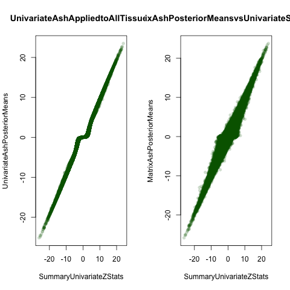
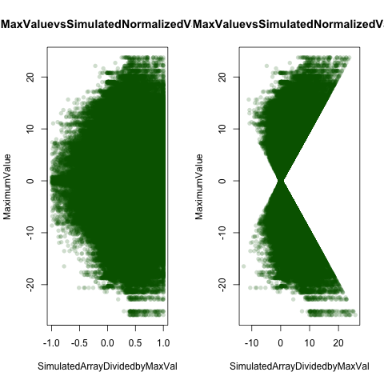
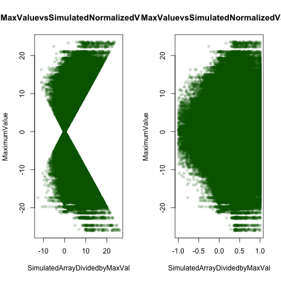
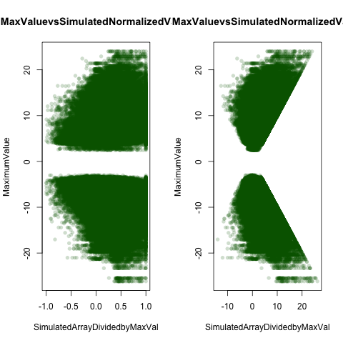

In this document I compare with univariate ash

```{r code,echo=FALSE}
#setwd("~/Dropbox/UnivariateAsh")
knitr::opts_chunk$set(cache=TRUE)
barfunc=function(genename){
  par(mfrow=c(1,2))
  t=genename
  name=strsplit(rownames(maxz)[t], "[.]")[[1]][1]
a=barplot(as.numeric(maxz[t,]),las=2,cex.names=0.5,main=paste0("Z Statistics",name),col=col.func.mle(qs$qvalues,z.stat = maxz,j = t),names=colnames(maxz))
legend("center",c("qval>0.5","0.5>qval>0.05","qval<0.05"),col=c("red","orange","green"),pch=20)
b=barplot(as.numeric(posterior.means[t,]),main=paste0("E(Z|EZ)",name),col=col.func(t,lfsr=lfsr,posterior.means=posterior.means),cex.names=0.5,las=2,ylab="PosteriorMean",names=colnames(posterior.means))
legend("center",c("lfsr>0.5","0.5>lfsr>0.05","lfsr<0.05"),col=c("red","orange","green"),pch=20)
}

het.norm=function(effectsize){
  t(apply(effectsize,1,function(x){
  x/x[which.max(abs(x))]
}))}


sign.norm=function(effectsize){
  t(apply(effectsize,1,function(x){
  x/sign(x[which.max(abs(x))])
}))}

col.func=function(lfsr,posterior.means,j){
  R=ncol(posterior.means)
  lfsr.mat=as.matrix(lfsr)
  col.mat=NULL
  for(r in 1:R){
 if (lfsr.mat[j,r]<=0.05) {
      col.mat[r]="green"
    } else if (lfsr.mat[j,r]<0.5) {
      col.mat[r]="orange"
    } else if (lfsr.mat[j,r]>=0.50) {
      col.mat[r]="red"
    } 
  }
  return(col.mat)
}


col.func.mle=function(qvalues,z.stat,j){
  R=ncol(posterior.means)
  q.mat=as.matrix(qvalues)
  col.mat=NULL
  for(r in 1:R){
 if (q.mat[j,r]<=0.05) {
      col.mat[r]="green"
    } else if (q.mat[j,r]<0.5) {
      col.mat[r]="orange"
    } else if (q.mat[j,r]>=0.50) {
      col.mat[r]="red"
    } 
  }
  return(col.mat)
}


L2norm = function(x){return(sqrt(sum(x^2)))}

norm_effects = function(m,standardize=TRUE){
  max_pos = apply(m,1,max)
  max_neg = apply(-m,1,max)
  max_sign = ifelse(max_pos>max_neg, 1,-1) #find the sign of the largest effect
  if(standardize){max_sign=max_sign* apply(m,1,L2norm)}
  m/max_sign
}


plot_tc = function(lfsr,curvedata,thresh=0.05){

  ##create a matrix showing whether or not lfsr satisfies threshold
  sigmat = lfsr <= thresh;
  sigs=which(rowSums(sigmat)==44)
  iplotCurves(curvedata[sigs,],chartOpts=list(curves_xlab="Tissue",curves_ylab="T statistic"))
}  


plot_ts=function(tissuename,lfsr,curvedata,thresh=0.05,subset=1:44){
  index_tissue=which(colnames(lfsr) %in% tissuename);

  ##create a matrix showing whether or not lfsr satisfies threshold
  sigmat = lfsr <= thresh;
  sigs=which(rowSums(sigmat[,index_tissue,drop=FALSE])==length(tissuename) & rowSums(sigmat[,-index_tissue,drop=FALSE])==0)
  
   iplotCurves(curvedata[sigs,subset],chartOpts=list(curves_xlab="Tissue",curves_ylab="curvedata"))}

plot_singletontissues=function(lfsr,thresh,method){
  
sigs=as.matrix(lfsr)<=thresh

ones=which(rowSums(sigs)==1)
barplot(apply(lfsr[which(rowSums(lfsr<=thresh)==1),],2,function(x){sum(x<=thresh)}),las=2,cex.names=0.5,main=paste0("Number of eQTL with",method,"<0.05 in Single Tissue"),ylim=c(0,620))
}

```

```{r get data,echo=FALSE}

pm.ash=read.table("~//Dropbox/UnivariateAsh/univariate.ash.pm.txt")
lfsr.ash=read.table("~/Dropbox/UnivariateAsh/univariate.ash.lfsr.txt")
maxz=read.table("~/Dropbox/jul3/maxz.txt")


pm.mash=read.table("~/Dropbox/Aug12/Aug13withEDposterior.means.txt")[,-1]
lfsr.mash=read.table("~/Dropbox/Aug12/Aug13withEDlfsr.txt")[,-1]
colnames(pm.mash)=colnames(lfsr.mash)=colnames(maxz)

png("compare.png")
par(mfrow=c(1,2))

plot(unlist(as.vector(maxz)),unlist(as.vector(pm.ash)),col=rgb(0,100,0,50,maxColorValue=255), pch=16,main="UnivariateAshAppliedtoAllTissues",xlab="SummaryUnivariateZStats",ylab="UnivariateAshPosteriorMeans")
plot(unlist(as.vector(maxz)),unlist(as.vector(pm.mash)),col=rgb(0,100,0,50,maxColorValue=255), pch=16,main="MatrixAshPosteriorMeansvsUnivariateSumStats",xlab="SummaryUnivariateZStats",ylab="MatrixAshPosteriorMeans")
dev.off()


```

```{r includeimage,echo=FALSE}
getwd()

```
We can consider the number of statistics at each threshold using both methods:

```{r}
thresh=0.05
sum(lfsr.mash<thresh)
sum(lfsr.ash<thresh)
```

We can see that Matrix ASH identifies `r sum(lfsr.mash<thresh)/sum(lfsr.ash<thresh)` more associations than using univariate ash. Furthemore, if we consider the number of genes with at least one LFSR less than threshold, we also identify more using this multivariate method. Using 

```{r count.number.genes}
gene.func=function(lfsr,thresh){
sigmat=lfsr<thresh
sum(rowSums(sigmat)!=0)}

gene.func(lfsr.mash,thresh=0.05)
gene.func(lfsr.ash,thresh=0.05)
```


Let's consider how are bias towards or against tissue speicificy changes:

```{r plotting number sig}

par(mfrow=c(1,2))
plot_singletontissues(lfsr.ash,thresh,method="ASH")
plot_singletontissues(lfsr.mash,thresh,method="MATRIXASH")
```

Let's also count how many associations we might count as inconsistent by simply counting the number of times the signs differed in a vector of posterior means for a given gene snp pair:

```{r}

inconsistent.func=function(posterior.means,lfsr,thresh=0.05){
h=apply(posterior.means,1,function(p){
  pos=sum(p>0);neg=sum(p<0);pos*neg!=0})
sum(h=="TRUE")}

inconsistent.func(pm.ash,lfsr.ash)
inconsistent.func(pm.mash,lfsr.mash)
```


If we restrict our analysis to only those considered significant at an lfsr threshold using ash computed LFSR, we have a smaller number, but this is simply because so many fewer associations are called significant using ash. Using the MASH lfsrs, the results are identical to using the univariate z statistics. WE can compare to the matrix ash posterior means as well.

```{r}
 thresh=0.05
z=sapply(seq(1:nrow(pm.ash)),function(x){
l=lfsr.ash[x,];p=pm.ash[x,];plow=p[which(l<thresh)];##grab only those posterior means that are 'significant'
if(length(plow)==0){return("FALSE")}##for ones who show no significants, they can't be heterogenous
else{pos=sum(plow>0);neg=sum(plow<0);pos*neg!=0}})
sum(z==TRUE)


z=sapply(seq(1:nrow(pm.ash)),function(x){
l=lfsr.mash[x,];p=pm.ash[x,];plow=p[which(l<thresh)];##grab only those posterior means that are 'significant'
if(length(plow)==0){return("FALSE")}##for ones who show no significants, they can't be heterogenous
else{pos=sum(plow>0);neg=sum(plow<0);pos*neg!=0}})
sum(z==TRUE)


z=sapply(seq(1:nrow(pm.mash)),function(x){
l=lfsr.mash[x,];p=pm.mash[x,];plow=p[which(l<thresh)];##grab only those posterior means that are 'significant'
if(length(plow)==0){return("FALSE")}##for ones who show no significants, they can't be heterogenous
else{pos=sum(plow>0);neg=sum(plow<0);pos*neg!=0}})
sum(z==TRUE)
```


```


We can also consider a histogram of normalized posterior means:

```{r}
z.stat=read.table("../Data/maxz.txt")
znorm=het.norm(effectsize = z.stat)
sum(znorm>0)/length(znorm)

matrix.ash.norm=het.norm(effectsize = pm.mash)
sum(matrix.ash.norm>0)/length(matrix.ash.norm)

par(mfrow=c(1,3))

hist(matrix.ash.norm,freq=FALSE,ylim=c(0,5),nclass=100,main="Z_jr|Data/Z_jr[which.max(abs(Z_jr|Data))],MASH")
legend("left",legend=paste0("mash.norm<0=",round((sum(matrix.ash.norm<0)/length(matrix.ash.norm)),3)))
uni.ash.norm=het.norm(effectsize = pm.ash)
sum(uni.ash.norm>0)/length(uni.ash.norm)
hist(uni.ash.norm,freq=FALSE,ylim=c(0,5),nclass=100,main="Z_jr|Data/Z_jr[which.max(abs(Z_jr|Data))],ASH")
legend("left",legend=paste0("uni.norm<0=",round((sum(uni.ash.norm<0)/length(matrix.ash.norm)),3)))
hist(znorm,freq=FALSE,ylim=c(0,5),nclass=100,main="Z_jr|Data/Z_jr[which.max(abs(Z_jr|Data))],Z_raw")
legend("left",legend=paste0("z.norm<0=",round((sum(znorm<0)/length(matrix.ash.norm)),3)))


mash.sign=sign.norm(effectsize = pm.mash)
uni.sign=sign.norm(effectsize = pm.ash)
z.sign=sign.norm(effectsize = z.stat)

par(mfrow=c(1,3))
hist(mash.sign,freq=FALSE,ylim=c(0,1),nclass=100,main="Z_jr|Data/sign(Z_jr[which.max(abs(Z_jr|Data))],MASH)")
legend("left",legend=paste0("mash.sign<0=",round((sum(matrix.ash.norm<0)/length(matrix.ash.norm)),3)))
hist(uni.sign,freq=FALSE,ylim=c(0,1),nclass=100,main="Z_jr|Data/sign(Z_jr[which.max(abs(Z_jr|Data))],ASH)")
legend("left",legend=paste0("uni.sign<0=",round((sum(uni.ash.norm<0)/length(matrix.ash.norm)),3)))

hist(z.sign,freq=FALSE,ylim=c(0,1),nclass=100,main="Z_jr|Data/sign(Z_jr[which.max(abs(Z_jr|Data))],Z.raw)")
legend("left",legend=paste0("z.sign<0=",round((sum(znorm<0)/length(matrix.ash.norm)),3)))

```


Understandably, there are no examples in which the sign of the posterior mean using univariate ash is flipped because there is no sharing of information across tissues, while with matrix ash, the sign changes about 18% of the time:

```{r comparing signs}
sum2=z.stat*pm.mash
sum(sum2<0)/length(unlist(sum2))
sumash=z.stat*pm.ash
sum(sumash<0)/length(unlist(sum2))
```

Let's consider the biplots of the values vs their maximums:
First, I plot the biplot of the posterior means using univariate ash vs their maximums:


Then, I make the same plot using the posterior means using matrix ash vs their maximums:



I verify that this is the same as the simulated values with matrix vs their maximums:



And I also plot the univariate z stats vs their maximums:



```{r, eval=FALSE}
rep.col<-function(x,n){
   matrix(rep(x,each=n), ncol=n, byrow=TRUE)
}
bi_plot_funcmaxz=function(max.val,znorm){
 a=rep.col(max.val,44)
  plot(znorm,a,main="MaxValuevsSimulatedNormalizedValue",xlab="SimulatedArrayDividedbyMaxVal",ylab="MaximumValue",col=rgb(0,100,0,50,maxColorValue=255), pch=16)
  }

max.val=apply(pm.ash,1,function(x){
  x[which.max(abs(x))]
})


png("uni.ash.biplot.png")
par(mfrow=c(1,2))
bi_plot_funcmaxz(max.val = max.val,znorm = uni.ash.norm)
bi_plot_funcmaxz(max.val = max.val,znorm = uni.sign)
dev.off()


max.val=apply(pm.mash,1,function(x){
  x[which.max(abs(x))]
})

png("mash.biplot.png")
par(mfrow=c(1,2))
bi_plot_funcmaxz(max.val = max.val,znorm = matrix.ash.norm)
bi_plot_funcmaxz(max.val = max.val,znorm = mash.sign)
dev.off()


max.val=apply(z.stat,1,function(x){
  x[which.max(abs(x))]
})

png("z.biplot.png")
par(mfrow=c(1,2))
bi_plot_funcmaxz(max.val = max.val,znorm = znorm)
bi_plot_funcmaxz(max.val = max.val,znorm = z.sign)
dev.off()
```