Here, I produce some of the figures for the paper.
```{r setup, include=FALSE}
library('knitr')
knitr::opts_chunk$set(cache=TRUE)
opts_chunk$set(fig.path = "/Users/sarahurbut/Dropbox/PaperEdits/Paper/Figures/PlotsForPaper_files/figure-html/") 
```

##Data from shared simulations##
```{r echo=FALSE}

data=readRDS("~/Dropbox/simdata.rds")
t=data$tstat;bhat=data$betahat;sebetahat=data$sebetahat;beta=data$beta;v.j=matrix(rep(1,ncol(t)*nrow(t)),ncol=ncol(t),nrow=nrow(t))
t.truth.test=beta/sebetahat
mash.means=read.table("~/Dropbox/Simulationsposterior.means.txt")[,-1]
univariate.ash.pm=read.table("~/Dropbox/univariate.ash.pm.txt")
bma.pm=read.table("~/Dropbox/testsimBMAonlyposterior.means.txt")[,-1]
lfsr.bma=read.table("~/Dropbox/testsimBMAonlylfsr.txt")[,-1]
lfsr.mash=read.table("~/Dropbox/Simulationslfsr.txt")[,-1]
lfsr.ash=read.table("~/Dropbox/univariate.ash.lfsr.txt")
thresh=0.05
```

Recall RMSE result:

```{r,eval=FALSE}
 Inference Method MASH    ASH  eqtlBMA-lite
RMSE_S            0.010 0.030   0.047
RMSE_TS           0.008 0.025   0.043
cor.with.truthS   0.99  0.94    0.84
cor.with.truthT S 0.99  0.94    0.82
```
 
```{r rmse,eval=FALSE,echo=FALSE}
sqrt(mean((beta[1:10000,]-mash.means*sebetahat)^2))
sqrt(mean((beta[1:10000,]-univariate.ash.pm*sebetahat)^2))
sqrt(mean((beta[1:10000,]-bma.pm*sebetahat)^2))

cor(unlist(as.vector(t.truth.test[1:10000,])), unlist(as.vector(bma.pm)))
cor(unlist(as.vector(t.truth.test[1:10000,])), unlist(as.vector(mash.means)))
cor(unlist(as.vector(t.truth.test[1:10000,])), unlist(as.vector(univariate.ash.pm)))
```

```{r echo=FALSE,cache=TRUE}
beta=as.matrix(beta[1:10000,])
lfsr.mash=as.matrix(lfsr.mash)
lfsr.ash=as.matrix(lfsr.ash)
lfsr.bma=as.matrix(lfsr.bma)

mash.means=as.matrix(mash.means)
ash.means=as.matrix(univariate.ash.pm)
bma.means=as.matrix(bma.pm)
```
First, ask how many non-zero associations we capture at a given threshold.
```{r echo=TRUE}
#chunk6
sum(sum(beta!=0&lfsr.mash<thresh))/sum(beta!=0)
sum(sum(beta!=0&lfsr.ash<thresh))/sum(beta!=0)
sum(sum(beta!=0&lfsr.bma<thresh))/sum(beta!=0)
```
Then, we compute the nominal lfsr (S) value, and we ask how many we correctly and incorrectly sign at a given threshold.

```{r echo=TRUE}
sign.test.mash=beta*mash.means
sign.test.ash=beta*ash.means
sign.test.bma=beta*bma.means
###compute nominal lfsr threshold
mean(lfsr.mash[lfsr.mash<0.05])
mean(lfsr.ash[lfsr.ash<0.05])
mean(lfsr.bma[lfsr.bma<0.05])

##ask what proportion of associations do we correctly sign 
sum(sign.test.mash>0&lfsr.mash<thresh)/sum(beta!=0)
sum(sign.test.ash>0&lfsr.ash<thresh)/sum(beta!=0)
sum(sign.test.bma>0&lfsr.bma<thresh)/sum(beta!=0)

##ask at a given lfsr threshold, how many are we incorrectly calling 
sum(sign.test.mash<=0&lfsr.mash<thresh)/sum(lfsr.mash<thresh)
sum(sign.test.ash<=0&lfsr.ash<thresh)/sum(lfsr.ash<thresh)
sum(sign.test.bma<=0&lfsr.bma<thresh)/sum(lfsr.bma<thresh)
```


And here we plot number sig vs significance threshold:
```{r,echo=FALSE}

plot(0.05,sum(sum(beta!=0&lfsr.mash<0.05)),col="blue",ylim=c(0,15000),xlim=c(0.01,0.10),pch=2,ylab="NumberofTrueAssociationsCaptured",xlab="LFSRThreshold")

for(thresh in seq(from = 0.01,to = 0.1,by = 0.001)){
points(thresh,sum(beta!=0&lfsr.mash<thresh),col="blue",pch=1)}
for(thresh in seq(from = 0.01,to = 0.1,by = 0.001)){
points(thresh,sum(beta!=0&lfsr.bma<thresh),col="red",pch=2)}
for(thresh in seq(from = 0.01,to = 0.1,by = 0.001)){
points(thresh,sum(beta!=0&lfsr.ash<thresh),col="green",pch=3)}

legend("bottom",legend=c("MASH","BMALite","ASH"),pch=c(2,1,3),col=c("blue","red","green"))
title("Number of True Association Captured vs Significance (LFSR) Threshold, Under Sharing")
```


```{r scatterplotshared,eval=FALSE, echo=FALSE}
post.means=as.matrix(mash.means)
univariate.ash.pm=as.matrix(univariate.ash.pm)

nulls=which(rowSums(data$beta)==0,)
null.vals=intersect(1:nrow(post.means),nulls)


post.b=as.matrix(post.means)*as.matrix(sebetahat[1:10000,])

png("~/Dropbox/PaperEdits/Paper/Figures/scatterplotscatterplotsharedmash.png")
plot(as.matrix(t[1:10000,]),as.matrix(post.means),col=adjustcolor("blue", alpha=0.5), pch=16,main="Significance_MASH vs Zmle",ylab="E(B|Data)/sebetahat",xlab="Zmle")
points(t[null.vals,],post.means[null.vals,],col="red")
#points(t[tspecific],post.means[tspecific],col="green")
legend("right",legend=c("TrueActivity","TrueNulls"),pch=1,col=c("blue","red"))
dev.off()

png("scatterplotscatterplotsharedash.png")
plot(as.matrix(t[1:10000,]),as.matrix(univariate.ash.pm),col=adjustcolor("blue", alpha=0.5), pch=16,main="Significance_ASH vs Zmle",ylab="E(B|Data)/sebetahat",xlab="Zmle")
points(t[null.vals,],univariate.ash.pm[null.vals,],col="red")
#points(t[tspecific],univariate.ash.pm[tspecific],col="green")
legend("right",legend=c("TrueActivity","TrueNulls"),pch=1,col=c("blue","red"))
dev.off()


#######


png("scatterplotscatterplotsharedtruthmash.png")
plot(as.matrix(beta[1:10000,]),as.matrix(post.means)*sebetahat[1:10000,],col=adjustcolor("blue", alpha=0.5), pch=16,main="E(B|Data_mash) vs B.true",ylab="E(B|Data)",xlab="B.truth",xlim=c(-1.5,1.5),ylim=c(-1.5,1.5))

mtext(paste0("RMSE=",round(sqrt(mean((beta[1:10000,]-post.means*sebetahat[1:10000,])^2)),2)))
points(beta[null.vals,],post.means[null.vals,]*sebetahat[null.vals,],col="red")
#points(beta[tspecific],post.means[tspecific]*sebetahat[tspecific],col="green")
legend("right",legend=c("Shared","TrueNulls"),pch=1,col=c("blue","red"))
dev.off()


png("scatterplotscatterplotsharedtruthmash.png")
plot(as.matrix(beta[1:10000,]),as.matrix(univariate.ash.pm)*sebetahat[1:10000,],col=adjustcolor("blue", alpha=0.5), pch=16,main="E(B|Data.ash) vs B.true",ylab="E(B|Data)",xlab="B.True",xlim=c(-1.5,1.5),ylim=c(-1.5,1.5))
mtext(paste0("RMSE=",round(sqrt(mean((beta[1:10000,]-univariate.ash.pm*sebetahat[1:10000,])^2)),2)))
points(beta[null.vals,],univariate.ash.pm[null.vals,]*sebetahat[null.vals,],col="red")
#points(beta[tspecific],univariate.ash.pm[tspecific]*sebetahat[tspecific],col="green")
legend("right",legend=c("Shared","TrueNulls"),pch=1,col=c("blue","red"))

dev.off()
```


##Data from tissue.specific.shared simulations##

```{r,echo=FALSE,cache=TRUE}
rm(list=ls())
data=readRDS("~/Dropbox/simdata_tspec.rds")
t=data$tstat;bhat=data$betahat;sebetahat=data$sebetahat;beta=data$beta;v.j=matrix(rep(1,ncol(t)*nrow(t)),ncol=ncol(t),nrow=nrow(t))
t.truth.test=beta/sebetahat
mash.means=read.table("~/Dropbox/testtissuespecposterior.means.txt")[,-1]
univariate.ash.pm=read.table("~/Dropbox/univariate.ash.pm.tspec.txt")
bma.pm=read.table("~/Dropbox/testimBMAonly_tspecposterior.means.txt")[,-1]
lfsr.bma=read.table("~/Dropbox/testimBMAonly_tspeclfsr.txt")[,-1]
lfsr.mash=read.table("~/Dropbox/testtissuespeclfsr.txt")[,-1]
lfsr.ash=read.table("~/Dropbox/univariate.ash.lfsr.tspec.txt")
thresh=0.05

```

```{r rmse.tspec,echo =FALSE,eval =FALSE}
sqrt(mean((t.truth.test[1:10000,]-mash.means)^2))
sqrt(mean((t.truth.test[1:10000,]-univariate.ash.pm)^2))
sqrt(mean((t.truth.test[1:10000,]-bma.pm)^2))


sqrt(mean((beta[1:10000,]-mash.means*sebetahat)^2))
sqrt(mean((beta[1:10000,]-univariate.ash.pm*sebetahat)^2))
sqrt(mean((beta[1:10000,]-bma.pm*sebetahat)^2))

cor(unlist(as.vector(t.truth.test[1:10000,])), unlist(as.vector(bma.pm)))
cor(unlist(as.vector(t.truth.test[1:10000,])), unlist(as.vector(mash.means)))
cor(unlist(as.vector(t.truth.test[1:10000,])), unlist(as.vector(univariate.ash.pm)))


cor(unlist(as.vector(beta[1:10000,])), unlist(as.vector(bma.pm*sebetahat)))
cor(unlist(as.vector(beta[1:10000,])), unlist(as.vector(mash.means*sebetahat)))
cor(unlist(as.vector(beta[1:10000,])), unlist(as.vector(univariate.ash.pm*sebetahat)))
```


```{r echo=FALSE,cache=TRUE}
beta=as.matrix(beta[1:10000,])
lfsr.mash=as.matrix(lfsr.mash)
lfsr.ash=as.matrix(lfsr.ash)
lfsr.bma=as.matrix(lfsr.bma)

mash.means=as.matrix(mash.means)
ash.means=as.matrix(univariate.ash.pm)
bma.means=as.matrix(bma.pm)
```
First, ask how many non-zero associations we capture at a given threshold.
```{r echo=TRUE}
sum(sum(beta!=0&lfsr.mash<thresh))/sum(beta!=0)
sum(sum(beta!=0&lfsr.ash<thresh))/sum(beta!=0)
sum(sum(beta!=0&lfsr.bma<thresh))/sum(beta!=0)
```
Then, we compute the nominal lfsr (S) value, and we ask how many we correctly and incorrectly sign at a given threshold.

```{r echo=TRUE}
sign.test.mash=beta*mash.means
sign.test.ash=beta*ash.means
sign.test.bma=beta*bma.means
###compute nominal lfsr threshold
mean(lfsr.mash[lfsr.mash<0.05])
mean(lfsr.ash[lfsr.ash<0.05])
mean(lfsr.bma[lfsr.bma<0.05])

##ask what proportion of associations do we correctly sign 
sum(sign.test.mash>0&lfsr.mash<thresh)/sum(beta!=0)
sum(sign.test.ash>0&lfsr.ash<thresh)/sum(beta!=0)
sum(sign.test.bma>0&lfsr.bma<thresh)/sum(beta!=0)

##ask at a given lfsr threshold, how many are we incorrectly calling 
sum(sign.test.mash<=0&lfsr.mash<thresh)/sum(lfsr.mash<thresh)
sum(sign.test.ash<=0&lfsr.ash<thresh)/sum(lfsr.ash<thresh)
sum(sign.test.bma<=0&lfsr.bma<thresh)/sum(lfsr.bma<thresh)
```


And here we plot number sig vs significance threshold:
```{r,echo=FALSE}

plot(0.05,sum(sum(beta!=0&lfsr.mash<0.05)),col="blue",ylim=c(0,15000),xlim=c(0.01,0.10),pch=2,ylab="NumberofTrueAssociationsCaptured",xlab="LFSRThreshold")

for(thresh in seq(from = 0.01,to = 0.1,by = 0.001)){
points(thresh,sum(beta!=0&lfsr.mash<thresh),col="blue",pch=1)}
for(thresh in seq(from = 0.01,to = 0.1,by = 0.001)){
points(thresh,sum(beta!=0&lfsr.bma<thresh),col="red",pch=2)}
for(thresh in seq(from = 0.01,to = 0.1,by = 0.001)){
points(thresh,sum(beta!=0&lfsr.ash<thresh),col="green",pch=3)}

legend("bottom",legend=c("MASH","BMALite","ASH"),pch=c(2,1,3),col=c("blue","red","green"))
title("Number of True Association Captured vs Significance (LFSR) Threshold, Under Sharing")
```


############

Now show the scatterplots demonstrating the tissue.specific scenario. Recall that the  purpose is to simulate according to the patterns of sharing present in the GTEX V6 Data, where 100 snps in cis of 500 genes, $\pi_0$ is 0.80, and there is sharing according to gtex covmats 2:9 and about 35% tissues specific. We can also plot the scatterplot to observe the behavior of 'null'(in red) and 'real'(in blue) associations. We see that our joint analysis reduces the Root Mean Squared Error (RMSE) and provides ample shrinkage of 'null values'.

```{r scatterplot,eval=FALSE, echo=FALSE}
post.means=as.matrix(mash.means)
univariate.ash.pm=as.matrix(univariate.ash.pm)

nulls=which(rowSums(data$beta)==0,)
null.vals=intersect(1:nrow(post.means),nulls)
tspec=which((data$component.id>8))
tissues=apply(t.truth.test[tspec,],1,function(x){
  which(x!=0)
})

tspecific=cbind(tspec,tissues)


post.b=as.matrix(post.means)*as.matrix(sebetahat[1:10000,])

png("scatterplot_fittedtspec.png")
plot(as.matrix(t[1:10000,]),as.matrix(post.means),col=adjustcolor("blue", alpha=0.5), pch=16,main="Significance_MASH vs Zmle",ylab="E(B|Data)/sebetahat",xlab="Zmle")
points(t[null.vals,],post.means[null.vals,],col="red")
#points(t[tspecific],post.means[tspecific],col="green")
legend("right",legend=c("TrueActivity","TrueNulls"),pch=1,col=c("blue","red"))
dev.off()

png("scatterplot_fittedtspec_ash.png")
plot(as.matrix(t[1:10000,]),as.matrix(univariate.ash.pm),col=adjustcolor("blue", alpha=0.5), pch=16,main="Significance_ASH vs Zmle",ylab="E(B|Data)/sebetahat",xlab="Zmle")
points(t[null.vals,],univariate.ash.pm[null.vals,],col="red")
#points(t[tspecific],univariate.ash.pm[tspecific],col="green")
legend("right",legend=c("TrueActivity","TrueNulls"),pch=1,col=c("blue","red"))
dev.off()

lfsr.mash=as.matrix(lfsr.mash)
ppsig=as.matrix(1-lfsr.mash)


png("scatterplot_fittedtspec_minuslfsr_mash.png")

plot(abs(as.matrix(t[1:10000,])),ppsig,col=adjustcolor("blue", alpha=0.5), pch=16,main="E(Z|Data) vs Zmle",ylab="E(Z|Data)",xlab="Zmle")
points(abs(t[null.vals,]),ppsig[null.vals,],col="red")
#points(t[tspecific],post.means[tspecific],col="green")
legend("right",legend=c("TureAssociations","TrueNulls"),pch=1,col=c("blue","red"))
dev.off()


lfsr.ash=as.matrix(lfsr.ash)
ppsig.ash=as.matrix(1-lfsr.ash)


png("scatterplot_fittedtspec_minuslfsr_ash.png")

plot(abs(as.matrix(t[1:10000,])),ppsig.ash,col=adjustcolor("blue", alpha=0.5), pch=16,main="E(Z|Data) vs Zmle",ylab="E(Z|Data)",xlab="Zmle")
points(abs(t[null.vals,]),ppsig.ash[null.vals,],col="red")
#points(t[tspecific],post.means[tspecific],col="green")
legend("right",legend=c("TureAssociations","TrueNulls"),pch=1,col=c("blue","red"))
dev.off()


png("scatterplot_truthtspec.png")
plot(as.matrix(t.truth.test[1:10000,]),as.matrix(post.means),col=adjustcolor("blue", alpha=0.5), pch=16,main="E(Z|Data_mash) vs Z.true",ylab="E(Z|Data)",xlab="Z.truth")
points(t.truth.test[null.vals,],post.means[null.vals,],col="red")
points(t.truth.test[tspecific],post.means[tspecific],col="green")
legend("right",legend=c(paste0("RMSE=",round(sqrt(mean((t.truth.test[1:10000,]-post.means)^2)),2)),"Tissue_specific","TrueNulls"),pch=1,col=c("blue","green","red"))
dev.off()


png("scatterplot_TRUTHashtspec.png")
plot(as.matrix(t.truth.test[1:10000,]),as.matrix(univariate.ash.pm),col=adjustcolor("blue", alpha=0.5), pch=16,main="E(Z|Data.ash) vs Z.True",ylab="E(Z|Data)",xlab="Z.True")
points(t.truth.test[null.vals,],univariate.ash.pm[null.vals,],col="red")
points(t.truth.test[tspecific],univariate.ash.pm[tspecific],col="green")
legend("right",legend=c(paste0("RMSE=",round(sqrt(mean((t.truth.test[1:10000,]-univariate.ash.pm)^2)),2)),"Tissue_specific","TrueNulls"),pch=1,col=c("blue","green","red"))
dev.off()


#######

png("scatterplotfittedbspec.png")
plot(as.matrix(bhat[1:10000,]),as.matrix(post.means)*sebetahat[1:10000,],col=adjustcolor("blue", alpha=0.5), pch=16,main="E(B|Data) vs Bmle",ylab="E(B|Data)",xlab="Bmle")
points(bhat[null.vals,],post.means[null.vals,]*sebetahat[null.vals,],col="red")
#points(bhat[tspecific],post.means[tspecific]*sebetahat[tspecific],col="green")

legend("right",legend=c("TrueActivity","TrueNulls"),pch=1,col=c("blue","red"))
dev.off()

png("scatterplotfitted_bspec_ash.png")
plot(as.matrix(bhat[1:10000,]),as.matrix(univariate.ash.pm)*sebetahat[1:10000,],col=adjustcolor("blue", alpha=0.5), pch=16,main="E(B|Data_ash) vs Bmle",ylab="E(B|Data_ash)",xlab="Bmle")
points(bhat[null.vals,],univariate.ash.pm[null.vals,]*sebetahat[null.vals,],col="red")
#points(bhat[tspecific],univariate.ash.pm[tspecific]*sebetahat[tspecific],col="green")
legend("right",legend=c("TrueActivity","TrueNulls"),pch=1,col=c("blue","red"))
dev.off()


png("scatterplot_truthbspec.png")
plot(as.matrix(beta[1:10000,]),as.matrix(post.means)*sebetahat[1:10000,],col=adjustcolor("blue", alpha=0.5), pch=16,main="E(B|Data_mash) vs B.true",ylab="E(B|Data)",xlab="B.truth",xlim=c(-1.5,1.5),ylim=c(-1.5,1.5))

mtext(paste0("RMSE=",round(sqrt(mean((beta[1:10000,]-post.means*sebetahat[1:10000,])^2)),2)))
points(beta[null.vals,],post.means[null.vals,]*sebetahat[null.vals,],col="red")
points(beta[tspecific],post.means[tspecific]*sebetahat[tspecific],col="green")
legend("right",legend=c("Shared","Tissue_specific","TrueNulls"),pch=1,col=c("blue","green","red"))
dev.off()


png("scatterplot_TRUTHashbspec.png")
plot(as.matrix(beta[1:10000,]),as.matrix(univariate.ash.pm)*sebetahat[1:10000,],col=adjustcolor("blue", alpha=0.5), pch=16,main="E(B|Data.ash) vs B.true",ylab="E(B|Data)",xlab="B.True",xlim=c(-1.5,1.5),ylim=c(-1.5,1.5))
mtext(paste0("RMSE=",round(sqrt(mean((beta[1:10000,]-univariate.ash.pm*sebetahat[1:10000,])^2)),2)))
points(beta[null.vals,],univariate.ash.pm[null.vals,]*sebetahat[null.vals,],col="red")
points(beta[tspecific],univariate.ash.pm[tspecific]*sebetahat[tspecific],col="green")
legend("right",legend=c("Shared","Tissue_specific","TrueNulls"),pch=1,col=c("blue","green","red"))
dev.off()

```

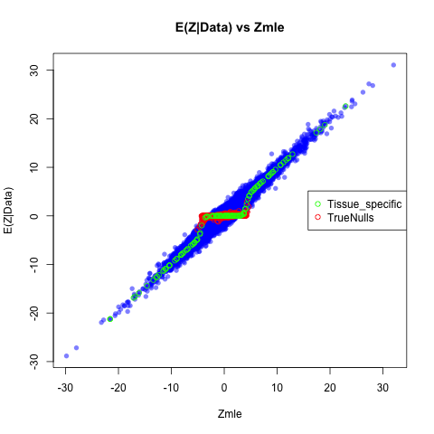 
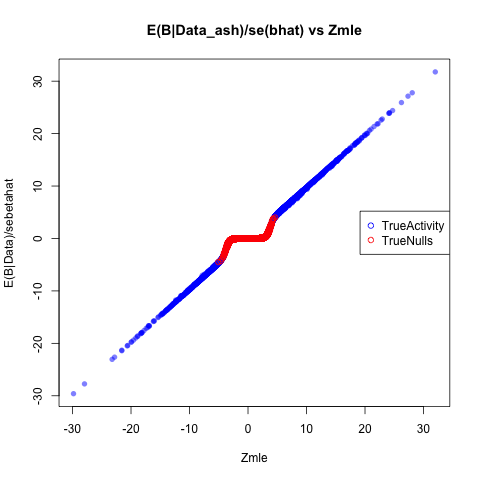
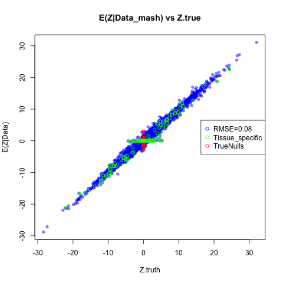


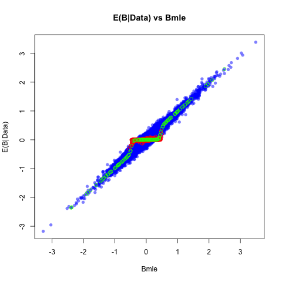 

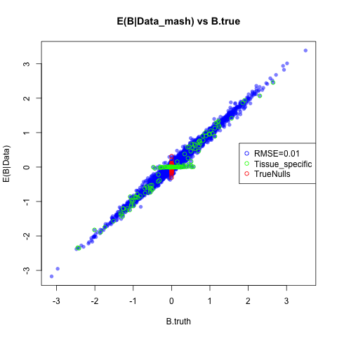
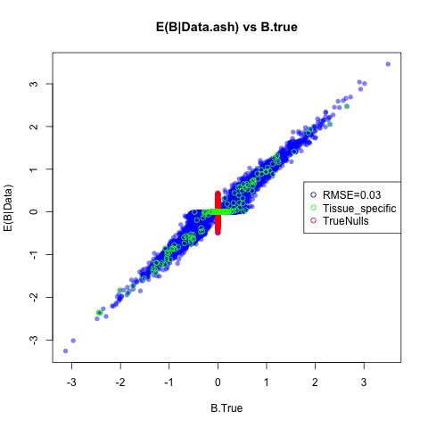

##REAL DATA RESULTS

Now, we would like to do this for the real data, plotting the posterior mean vs the input summary statistic using both ash and MASH.

```{r,echo=FALSE,eval=TRUE}

abr.names=read.table("../../Data/abbreviate.names.txt")
standard.error=read.table("../../Data/standard.error.txt")
pm.ash=read.table("~//Dropbox/UnivariateAsh/univariate.ash.pm.txt")

pm.ash.beta=pm.ash*standard.error

lfsr.ash=read.table("~/Dropbox/UnivariateAsh/univariate.ash.lfsr.txt")
maxz=read.table("~/Dropbox/jul3/maxz.txt")

z.stat=maxz
maxb=read.table("../../Data/maxbetahats.txt")

pm.mash=read.table("~/Dropbox/Aug12/Aug13withEDposterior.means.txt")[,-1]

pm.mash.beta=pm.mash*standard.error

lfsr.mash=read.table("~/Dropbox/Aug12/Aug13withEDlfsr.txt")[,-1]

lfsr.bma=read.table("~/Dropbox/bmawithzerolfsr.txt")[,-1]
colnames(pm.mash.beta)=colnames(pm.ash.beta)=colnames(lfsr.mash)=colnames(maxz)=colnames(lfsr.bma)
colnames(pm.mash.beta)=colnames(pm.ash.beta)=colnames(lfsr.mash)=colnames(maxz)
```

```{r,echo=FALSE,eval=FALSE}

png("comparebeta.png")
par(mfrow=c(1,2))

plot(unlist(as.vector(maxb)),unlist(as.vector(pm.ash.beta)),col=rgb(0,100,0,50,maxColorValue=255), pch=16,main="E(B|D)vsB.hat_ASH",xlab="B.hat",ylab="ASH__E(B|D)")
plot(unlist(as.vector(maxb)),unlist(as.vector(pm.mash.beta)),col=rgb(0,100,0,50,maxColorValue=255), pch=16,main="E(B|D)vsB.hat_MASH",xlab="B.hat",ylab="MASH_E(B|D)")
dev.off()


png("comparez.png")
par(mfrow=c(1,2))

plot(unlist(as.vector(maxz)),unlist(as.vector(pm.ash)),col=rgb(0,100,0,50,maxColorValue=255), pch=16,main="SignificancevsZ.hat_ASH",xlab="Z",ylab="ASH__E(B|D)*sj")
mtext("Associations called: 91,755")
plot(unlist(as.vector(maxz)),unlist(as.vector(pm.mash)),col=rgb(0,100,0,50,maxColorValue=255), pch=16,main="SignificancevsZ.hat_MASH",xlab="Z",ylab="MASH__E(B|D)*sj")
mtext("Associations called: 393,414")
dev.off()
```
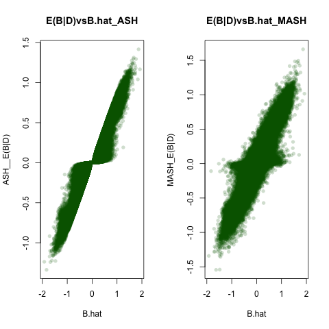
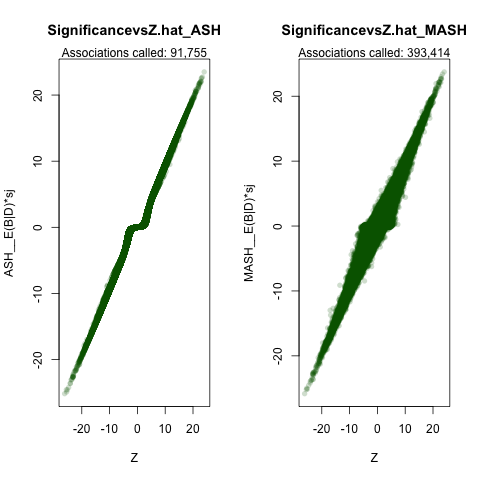

Recall Power Results:
```{r,eval=FALSE}
Metric                    LFSR_MatrixAsh LFSR_ASH   LFSR_eQTL-BMALite
Significant b_{jr} ≤ 0.05 393,414           91,755 314771
```
 
Now, we would like to compare the pi.matrices to see from where the prior weight is arising. Here, we demonstrate the 'parsing'.

```{r,echo=FALSE}
par(mfrow=c(1,2))
pi.bma=readRDS("~/Dropbox/pisbmawithzero.rds")$pihat
pi.mat=matrix(data = pi.bma[-length(pi.bma)],ncol =48,byrow = TRUE)
barplot(colSums(pi.mat),las=2,names=c("ID",as.matrix(abr.names[,2]),"het=0.25","het=0.5","het=0"),main="mash.litePriorWeight",cex.names = 0.5)
mtext("Likelihood= -1,282,984") 
pi.mash=readRDS("../../Data/pisAug13withED.rds")$pihat
#pi.mash=readRDS("~/Dropbox/withzero/piswithzero.rds")$pihat[-1189]
pi.mat.mash=matrix(data = pi.mash,nrow = 22,ncol =54,byrow = TRUE)
barplot(colSums(pi.mat.mash),las=2,names=c(paste0("Uk",seq(1:9)),as.matrix(abr.names[,2]),"all"),main="MASHPriorWeight",cex.names = 0.5)
mtext("Likelihood = −1,267,990.5")
```

We can see that the majority of the weight is not on the fully `consistent' configuration, whereas this is not the case for BMA:
```{r}
sum(colSums(pi.mat.mash[,-54]))
sum(colSums(pi.mat[,-45]))
```
And here, I wanted to demonstrate several 'tissue' by 'tissue plots, where eQTL are grouped by their loading.
We see some tissue specific activity, some highly correlated (e.g., both colons), and tissue pairs in which SNPS are active in both (skeletal muscle and brain) but the ratios differ among groups.

```{r, echo=FALSE}
components=read.table("../../Data/maxColsums.txt")[,1]

covmat=readRDS("../../Data/covmatAug13withED.rds")

pm.mash.brain=pm.mash
colnames(pm.mash.brain)=colnames(maxz)
biplot_by_component=function(tissue1,tissue2){
  i=tissue1;j=tissue2
  pm.mash.brain=as.matrix(pm.mash.brain)
plot(pm.mash.brain[components==2,i],pm.mash.brain[components==2,j],col="yellow",xlab=colnames(pm.mash.brain)[i],ylab=colnames(pm.mash.brain)[j])
points(pm.mash.brain[components==9,i],pm.mash.brain[components==9,j],col="blue")
points(pm.mash.brain[components==49,i],pm.mash.brain[components==49,j],col="black")
points(pm.mash.brain[components==3,i],pm.mash.brain[components==3,j],col="green")

points(pm.mash.brain[components==4,i],pm.mash.brain[components==4,j],col="red")
points(pm.mash.brain[components==5,i],pm.mash.brain[components==5,j],col="pink")
points(pm.mash.brain[components==53,i],pm.mash.brain[components==53,j],col="violet")
points(pm.mash.brain[components==8,i],pm.mash.brain[components==8,j],col="orange")
abline(c(0,1));abline(h=0);abline(v=0)
}


#biplot_by_component(34,44)
#biplot_by_component(34,40)
biplot_by_component(44,40)
#biplot_by_component(tissue1 = 7,40)
biplot_by_component(tissue1 = 7,tissue2=44)
biplot_by_component(tissue1 = 7,tissue2=29)
#biplot_by_component(tissue1 = 42,tissue2=29)
#biplot_by_component(tissue1 = 18,tissue2=29)
biplot_by_component(tissue1 = 18,tissue2=40)
biplot_by_component(tissue1 = 21,tissue2=20)
```

Now, I want to give a gross overview of all the patterns of correlations. Here, I plot heatmaps of all 8 learned matrices:

```{r,echo=FALSE,eval=FALSE }

library(gplots)
library(ggplot2)
#install.packages("fields")
library(fields)
library("gridGraphics")
gl=list()

grab_grob <- function(){
  grid.echo()
  grid.grab()
}

# gl=lapply(2:9,function(k){
#   x=covmat[[k]]
#   colnames(x)=colnames(z.stat)
#   rownames(x)=colnames(z.stat)
# heatmap.2(x/max(diag(covmat[[k]])),Rowv=FALSE,Colv=FALSE,symm=TRUE,key=ifelse(k==2,TRUE,FALSE),#labRow = ifelse(k==5,colnames(z.stat),""),#labCol  = ifelse(k==3,colnames(z.stat),""),
#           dendrogram="none",density="none",trace="none",col=redblue(256),main=paste0("HeatMapofNormalizedUk",k),cexRow=0.5,cexCol=0.5,symbreaks=T,symkey = T)
# grab_grob()
# })
#  
# grid.newpage()
# library(gridExtra)
# grid.arrange(grobs=gl, ncol=3, clip=TRUE)


for(k in 2:9){
   ifile <- paste0(k,'_allheatmaps.png')
    pdf(ifile)
  x=covmat[[k]]
  colnames(x)=colnames(z.stat)
  rownames(x)=colnames(z.stat)
heatmap.2(x/max(diag(covmat[[k]])),Rowv=FALSE,Colv=FALSE,symm=TRUE,dendrogram="none",density="none",trace="none",col=redblue(256),main=paste0("HeatMapofNormalizedUk",k),cexRow=0.5,cexCol=0.5,symkey=T,symbreaks=T,key=ifelse(k==2,TRUE,FALSE))
dev.off()
}
system('montage -geometry 100% -tile 3x3 ./*_allheatmaps.png ./gtexresultcompiledheatmaps.png')
```

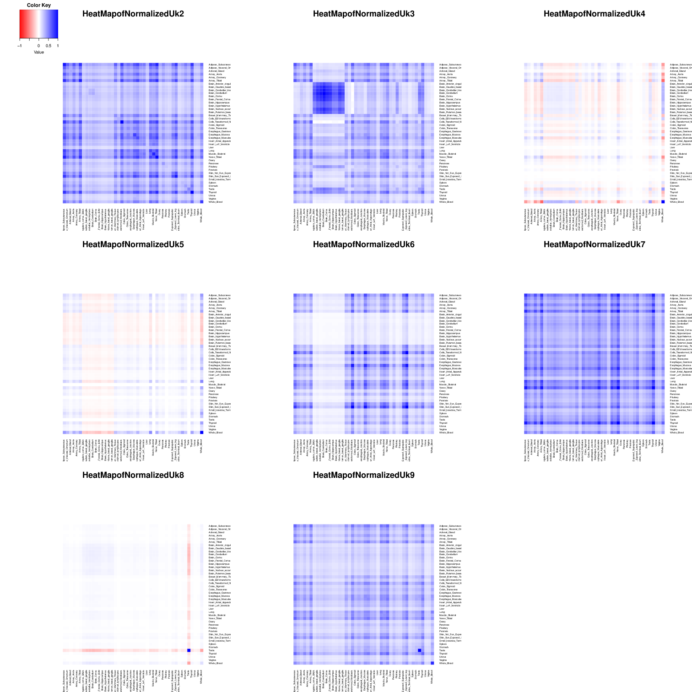.

According to the text, I give examples of $U_{k}=3$, $U_{k}=9$ and eQTLBMA lite config (for qualitative specificity). In the example for 3, strong, shared effects in brain tissues match an 349 underlying pattern of shared effects present in the larger data set and thus allows this 350 gene-snp pair to find its true match. Brain effect sizes thus borrow strength from one 351 another, and accordingly, the posterior estimates tend to nudge the brains towards a onsistent, shared effect. Similarly, an overall tendency towards consistency in sign in  the larger data set, as captured by the hierarchical model and reflected in the positive correlation in sign among all tissues, tends to ‘flip’ erratic off directions towards the prevailing positive direction. Heterogeneity in magnitude among the other tissues is 356 reflected in the variety of banding intensity along the diagonal.


```{r echo=FALSE}


posterior.means=pm.mash.brain
lfsr=lfsr.mash

newfunc=function(t){
  par(mfrow=c(1,2))
  name=strsplit(rownames(z.stat)[t], "[.]")[[1]][1]
a=barplot(as.numeric(z.stat[t,]),xlab="Tissue")#,las=2,cex.names=0.5,names=colnames(z.stat))
title(main=paste0("Z Statistic"),font.main=1,col.main="blue")
mtext(paste0(name),col="purple")
b=barplot(as.numeric(posterior.means[t,]),col=col.func(t,lfsr=lfsr,posterior.means=posterior.means),xlab="Tissue",#cex.names=0.5,las=2,
          ylab="E(B|Data)/s.j")#,names=colnames(posterior.means))
title(main=paste0("E(B|Data)/s.j"),font.main=1,col.main="blue")
mtext(paste0(name),col="purple")
}

col.func=function(lfsr,posterior.means,j){
  R=ncol(posterior.means)
  lfsr.mat=as.matrix(lfsr)
  col.mat=NULL
  for(r in 1:R){
 if (lfsr.mat[j,r]<=0.05) {
      col.mat[r]="green"
    } else if (lfsr.mat[j,r]<0.5) {
      col.mat[r]="orange"
    } else if (lfsr.mat[j,r]>=0.50) {
      col.mat[r]="red"
    } 
  }
  return(col.mat)
}


library(gplots)
library(ggplot2)

#three.ex.1=which(rownames(z.stat)=="ENSG00000205771.2_15_44721087_T_A_b37")
three.ex.2=which(rownames(z.stat)=="ENSG00000253520.1_5_179052185_C_G_b37")
three.ex.3=which(rownames(z.stat)=="ENSG00000249898.3_8_6521432_T_C_b37")
#three.ex.4=which(rownames(z.stat)=="ENSG00000058404.15_7_44259706_G_A_b37")

    
#weightplot(genename = three.ex.1,max.weight = 3,covmat = covmat)

k=3
x=covmat[[k]]/max(diag(covmat[[k]]))
colnames(x)=colnames(z.stat)
  rownames(x)=colnames(z.stat)                  
# heatmap.2(x,Rowv=FALSE,Colv=FALSE,symm=TRUE,dendrogram="none",density="none",trace="none",col=redblue(256),main=paste0("HeatMapofNormalizedUk",k),cexRow=0.5,cexCol=0.5,symkey=T,symbreaks=T)
v=svd(x)$v

rownames(v)=colnames(v)=as.matrix(abr.names[,2])
barplot(v[,1]*sign(v[which.max(abs(v[,1])),1]),las=2,main=paste("Eigenvector 1 of Uk",k),cex.names = 0.5)
#newfunc(three.ex.2)
newfunc(three.ex.3)

```

In this example, though the particular pattern featured (Uk = 9) captures correlation in sign among all tissues, significant quantitative heterogeneity is again reflected in the intensity of the banding along the diagonal, in this dramatically dichotomous between testes/whole blood and all other tissues. Here, we introduce the idea of quantitative specificity - e.g., that a SNP can be modestly ‘active’ in all tissues though to dramatically different degrees. here, though this matrix was learned (and not forced, as in eQTLBMA-lite) from the data, the pattern of quantitative tissue specificity in testes and whole blood is evident. Again, erratic, off-directions are flipped in sign. We refer to this as quantitative specificity, because the effects are quantitatively unique toparticular tissues - e.g., significantly larger in magnitude in testis than all other tissues -  and yet considered non-zero in all tissues. This is in contrast to qualitative specificity,  described below, in which we would conclude that the QTL is active in only one tissue. 

```{r,echo=FALSE}

#k=9
k=5
x=covmat[[k]]/max(diag(covmat[[k]]))
  colnames(x)=colnames(z.stat)
  rownames(x)=colnames(z.stat)                  
# heatmap.2(x,Rowv=FALSE,Colv=FALSE,symm=TRUE,dendrogram="none",density="none",trace="none",col=redblue(256),main=paste0("HeatMapofNormalizedUk",k),cexRow=0.5,cexCol=0.5,symkey=T,symbreaks=T)
five.ex=which(rownames(z.stat)=="ENSG00000120029.8_10_103924251_G_A_b37")
nine.ex.2=which(rownames(z.stat)=="ENSG00000059588.5_1_234612995_T_C_b37")
nine.ex.3=which(rownames(z.stat)=="ENSG00000009830.7_14_77776501_T_A_b37")
spec.ex=which(rownames(z.stat)=="ENSG00000131848.5_19_56741808_G_A_b37")
#barplot(diag(x),las=2,main=paste("Prior Variance of Effect Size for Uk",k),cex.names = 0.5)

#newfunc(t=nine.ex.3)

v=svd(x)$v
rownames(v)=colnames(v)=as.matrix(abr.names[,2])
barplot(v[,1]*sign(v[which.max(abs(v[,1])),1]),las=2,main=paste("Eigenvector 1 of Uk",k),cex.names = 0.5)
newfunc(t=five.ex)
```

 Lastly, the inclusion of the eQTLBMA lite configurations (in which the SNP has a non-zero effect in only one tissue) coupled with the learned patterns of tissue specificity evident in matrices Uk : 5 − 9 serve to allow the preservation of qualitatively specific effects. Here, we show a gene-snp pair demonstrating strong posterior probability from arising from one of the eQTL-bma lite configs. Accordingly we reject the significance of the effect size estimates in all tissues but testes, a pattern consistent with the presence of tissue-specificity described below. Together, these results cement the resolution afforded by methods which can distinguish among tissues in which a QTL is called active, beyond reducing genetic effects to binary ‘on’ or ‘off’ conclusions.
 
 
```{r,echo=FALSE}
#newfunc(t=nine.ex.2)

eqtlbma.confg=t(as.matrix(c(rep(0,43),1)))
colnames(eqtlbma.confg)=as.matrix(abr.names[,2])
barplot(eqtlbma.confg,main="SingletonConfig",las=2,cex.names=0.5)
wholebloodtwo=(which(rownames(maxz)=="ENSG00000078114.14_10_21501314_T_C_b37"))
newfunc(t = wholebloodtwo)
```

## Now we discuss Tissue specificity

```{r,echo=FALSE,eval=TRUE}
plot_ts=function(tissuename,lfsr,curvedata,thresh=0.05,subset=1:44){
  index_tissue=which(colnames(lfsr) %in% tissuename);

  ##create a matrix showing whether or not lfsr satisfies threshold
  sigmat = lfsr <= thresh;
  sigs=which(rowSums(sigmat[,index_tissue,drop=FALSE])==length(tissuename) & rowSums(sigmat[,-index_tissue,drop=FALSE])==0)
  
   iplotCurves(curvedata[sigs,subset],chartOpts=list(curves_xlab="Tissue",curves_ylab="curvedata"))}


colnames(lfsr)=colnames(posterior.means)=colnames(z.stat)
rownames(lfsr)=rownames(posterior.means)=rownames(z.stat)
maxz=z.stat
thresh=0.05
dist=as.matrix(lfsr)<=thresh

ones=which(rowSums(dist)==1)
thresh=0.05
barplot(apply(lfsr[which(rowSums(lfsr<=thresh)==1),],2,function(x){sum(x<=thresh)}),las=2,cex.names=0.5,main=paste0("Number of eQTL with LFSR<",0.05," in Single Tissue"),ylim=c(0,420))
 
# zthresh=5
# barplot(apply(maxz[which(rowSums(maxz>zthresh)==1),],2,function(x){sum(x>zthresh)}),las=2,cex.names=0.5,main=paste0("Number of eQTL with Z>",zthresh,"in Single Tissue"),ylim=c(0,400))

```

Furthermore, tissue specific eQTL demonstrate the smoothing feature of this joint shrinkage approach.

First, we plot the 'singletons' of the observed noisy values.
```{r,cache=FALSE,echo=FALSE,eval=FALSE}
library(qtlcharts)
id=colnames(maxz)
iplotCurves(as.matrix(maxz)[ones,],1:44,chartOpts=list(xlab="Tissue Indices", ylab="Z_mle",pointcolor=c("slateblue")))

#barplot(as.matrix(maxz)[ones,],las=2,colnames=colnames(maxz))
#barplot(as.matrix(posterior.means)[ones,],las=2,names=colnames(maxz))
```


Now, we plot the matrix-ash shrunken $E(Z|Data)$. 
```{r,cache=FALSE,echo=FALSE,eval=FALSE}
iplotCurves(as.matrix(posterior.means[ones,]),1:44,chartOpts=list(xlab="Tissue Indices", ylab="E(Z|Data)",pointcolor=c("slateblue")))
```


##Heterogeneity Analysis

First, we asked in how many tissues is a QTL signficiant. 


```{r,echo=FALSE}
thresh=0.05
sigmat=(lfsr<=thresh)
nsig= rowSums(sigmat)
hist(nsig[nsig>0],main="Number of tissues in which eQTl significant", nclass=45,xlab="Number of tissues",col="blue")
```


But now, we can ask much more interesting questions.

```{r,echo=FALSE}
thresh_inconsistent=function(effectsize,thresh,sigs){
 z= sapply(seq(1:nrow(effectsize)),function(x){
l=sigs[x,];p=effectsize[x,];plow=p[which(l<thresh)];##grab only those posterior means that are 'significant'
if(length(plow)==0){return("FALSE")}##for ones who show no significants, they can't be heterogenous
else{pos=sum(plow>0);neg=sum(plow<0);pos*neg!=0}
})
return(sum(z==TRUE))}


het.norm=function(effectsize){
  t(apply(effectsize,1,function(x){
  x/x[which.max(abs(x))]
}))}


sign.norm=function(effectsize){
  t(apply(effectsize,1,function(x){
  x/sign(x[which.max(abs(x))])
}))}

sign.tissue.func=function(normdat){
  apply(normdat,1,function(x){
    sum(x<0)})}


het.func=function(normdat,threshold){
  apply(abs(normdat),1,function(x){sum(x>threshold)})}
```


```{r,echo=FALSE}
pm.mash.beta.brain=pm.mash.beta
rm(pm.mash.beta)
lfsr.brain=read.table("../../Data//Aug13withEDlfsr.txt")[,-1]

pm.mash.nobrain=read.table("../../withoutbrain//nobrainposterior.means.txt")[,-1]
standard.error.nobrain=read.table("../../Data/standard.error.txt")[,-c(7:16)]
pm.mash.beta.nobrain=pm.mash.nobrain*standard.error.nobrain
lfsr.nobrain=read.table("../../withoutbrain/nobrainlfsr.txt")[,-1]

signbrain=mean(het.norm(pm.mash.beta.brain)>0)
signnobrain=mean(het.norm(pm.mash.beta.nobrain)>0)
magbrain=mean(het.norm(pm.mash.beta.brain)>0.5)
magnobrain=mean(het.norm(pm.mash.beta.nobrain)>0.5)

gene_cons_all=1-thresh_inconsistent(effect = pm.mash.beta.brain,thresh=0.05,sigs =lfsr.brain)/nrow(pm.mash.beta.brain)
gene_cons_nobrain=1-thresh_inconsistent(effect=pm.mash.beta.nobrain,thresh = 0.05,sigs = lfsr.nobrain)/nrow(pm.mash.beta.nobrain)
```

```{r,eval=FALSE}
                                              All  No Brains
$E(ConsistentSignPosteriorMean | LFSR≤0.05)$  0.852 0.802
E(At least 50% max value)                     0.354 0.449
Normalized B_jr >0                            0.833 0.879
```


Heterogeneity in sign:


```{r,echo=FALSE}


par(mfrow=c(1,3))
hist(sign.tissue.func(het.norm(effectsize=pm.mash.beta.brain))/44,main="Proportion of Tissues in which SignDifferentThanMax,ALL",xlab="NumberofTissues",nclass=50,col="blue",freq=FALSE,ylim=c(0,40))
hist(sign.tissue.func(het.norm(effectsize=pm.mash.beta.nobrain))/34,main="Proportion of Tissues in which SignDifferentThanMax, EXCLUDING brain",xlab="NumberofTissues",nclass=40,col="blue",freq=FALSE,ylim=c(0,40))
hist(sign.tissue.func(het.norm(effectsize=pm.mash.beta.brain[,c(7:16)]))/10,main="Proportion ofin which SignDifferentThanMax,brain",xlab="NumberofTissues",nclass=40,col="blue",freq=FALSE,ylim=c(0,40))
```

And we consider heterogeneity in magnitude:

```{r,echo=FALSE}
par(mfrow=c(1,4))
hist((het.func(het.norm(effectsize=pm.mash.beta.brain),threshold=0.5)),main="Number of Tissues in which B.norm>0.5*MaxBALLTISSUES",xlab="NumberofTissues",nclass=50,col="blue",freq=FALSE)

hist((het.func(het.norm(effectsize=pm.mash.beta.nobrain),threshold=0.5)),main="Number of Tissues in which B.norm>0.5*MaxBEXCLUDINGBRAIN",xlab="NumberofTissues",nclass=40,col="blue",freq=FALSE)

brain.norm=het.norm(effectsize=pm.mash.beta.brain[,c(7:16)])
hist(het.func(brain.norm,threshold=0.5),main="Number of Tissues in which B.norm>0.5*MaxBrainOnly",xlab="NumberofTissues",nclass=12,col="blue",freq=FALSE)

post.means.brain.only=read.table("~/Dropbox/BrainOnly/brainonlyposterior.means.txt")[,-1]
pm.brain.nbeta=post.means.brain.only*standard.error[,c(7:16)]

brain.norm=het.norm(effectsize=pm.brain.nbeta)
hist(het.func(brain.norm,threshold=0.5),main="Number of Tissues in which B.norm>0.5*MaxBrainOnly",xlab="NumberofTissues",nclass=12,col="blue",freq=FALSE,ylim=c(0,0.4))

post.means.brain.only=read.table("~/Dropbox/BrainOnly/brainonlyposterior.means.txt")[,-1]
pm.brain.nbeta=post.means.brain.only*standard.error[,c(7:16)]
```

Some additional quantities we may want to consider:

Now, let's consider the number of tissues vs normalziing value. We plot the median of the value used to normalize for each group of SNPs that are of the same number of tissue class. For each 's' class, grab QTL that have that many tissues > max effect, find the effect used to normalize them, and take median of those s class maxes.
We can see that the 'brain homogenous effects' (i.e., tissues in which the brain was chosen as the tissue of max effect) seem to have a lower median max effect, indicating that when brain is the highest, the other effects tend to be small. 

```{r,echo=FALSE}
ebnorm=het.norm(effectsize=pm.mash.beta.brain)
h=het.func(ebnorm,threshold=0.5)
max.mash.brain=apply(pm.mash.beta.brain,1,function(x){
(x[which.max(abs(x))])})
s=sapply(seq(1:44),function(x){
tissue.match=which(h==x)
median(abs(max.mash.brain[tissue.match]))})
   
plot(seq(1:44),s,ylab="Median(Abs(MaxValue))foreQTLofSclass",xlab="NumberofTissues>50% maxEffect")
```


How do the tissues with high or low values of our heterogeneity index behave?

Let's looks at how heterogeneity behaves. Here, we plot examples in which the vast majority of tissues have a heterogeneity index greater than 50%. We plot the E(Z|D) for those in which the QTL were 'homogeneous ' in most: 

```{r,cache=FALSE,eval=FALSE,echo=FALSE}
#h.all=het.func(normalized.all,threshold=0.5)## Normalize and determine heterogeneity based on E(b\Data) with negative values excluded
h.all=het.func(het.norm(pm.mash.beta.brain),threshold = 0.5)
library(qtlcharts)
#rownames(pm.mash.all)=rownames(normalized.all)
iplotCurves(curveMatrix = pm.mash[h.all>40,],chartOpts=list(curves_xlab="Tissue", curves_ylab="E(Z|D)"))

#iplotCurves(curveMatrix = pm.mash.all[hetindex>30,],chartOpts=list(curves_xlab="Tissue", curves_ylab="E(Z|D)"))
#iplotCurves(curveMatrix = pm.mash.beta.brain[h.all<2,])
```

Now, we look at eQTL in which the effects are consistent in only a few:
```{r,cache=FALSE,echo=FALSE,eval=FALSE}
iplotCurves(curveMatrix = pm.mash[h.all<2,],chartOpts=list(curves_xlab="Tissue", curves_ylab="E(Z|D)"))
#iplotCurves(curveMatrix = pm.mash.all[hetindex<2,],chartOpts=list(curves_xlab="Tissue", curves_ylab="E(Z|D)"))
#iplotCurves(curveMatrix = z.stat[het.genes.with.brain<2,],chartOpts=list(curves_xlab="Tissue", curves_ylab="Z.statBrain"))
```
From this comparison we can also see that the non-homogenous eQTL tned to have smaller max effects.

Lastly, we can consider the biplot which plots the Posterior mean vs the Value used to normalize it, to consider if large effects occur in the presence of similar size effects (e.g., normalized effect sizes close to one)

```{r, eval=FALSE,echo=FALSE}
R=ncol(pm.mash.beta)
colnames(pm.mash.beta)=colnames(maxb)

max.mash=t(apply(pm.mash.beta.nobrain,1,function(x){
  R=length(x)
  rep(x[which.max(abs(x))],R)
}))


max.mash.brain=t(apply(pm.mash.beta.brain,1,function(x){
    R=length(x)
  rep(x[which.max(abs(x))],R)
}))


png("normstuffeb_nobrain.png")
#par(mfrow=c(1,2))
plot(abs(max.mash),het.norm(effectsize = pm.mash.beta.nobrain),main="E(B_jrnorm,ExcludingBrain)",xlab="absNormalizingValue",ylab="E(B|data)_norm", 
     col=rgb(0,100,0,50,maxColorValue=255), pch=16,xlim=c(0,2))
#plot(abs(max.mle),bnorm,main="NormalizingB.MLE",ylab="B_norm",xlab="absNormalizingValue",col=rgb(0,100,0,50,maxColorValue=255), pch=16,xlim=c(0,2))
dev.off()


png("normstuffeb_alltissues.png")
par(mfrow=c(1,1))
plot(abs(max.mash.brain),het.norm(effectsize = pm.mash.beta.brain),main="E(B_jrnorm,Alltissues)",xlab="absNormalizingValue",ylab="E(B|data)_norm", 
     col=rgb(0,100,0,50,maxColorValue=255), pch=16,xlim=c(0,2))
#plot(abs(max.mle),bnorm,main="NormalizingB.MLE",ylab="B_norm",xlab="absNormalizingValue",col=rgb(0,100,0,50,maxColorValue=255), pch=16,xlim=c(0,2))
dev.off()

```

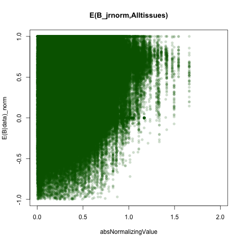

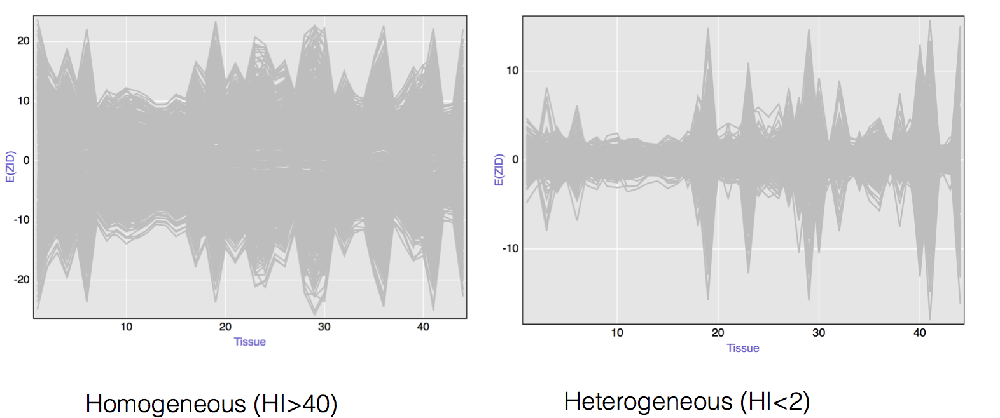


To plot the PC:

```{r}

par(mfrow=c(3,3))
par(mar=c(4,3,2,1))
for(i in 2:9){
  
v=svd(covmat[[i]])$v
  colnames(v)=rownames(v)=abr.names[,2]
max.effect=sign(v[,1][which.max(abs(v[,1]))])
barplot(max.effect*v[,1],las=2,main=paste0("EigenVector1ofUk=",i),#main=ifelse(i!=5,paste0("EigenVector1ofUk=",i),""),ylab=ifelse(i==5,paste0("EigenVector1ofUk=",i),""),
        col=i-1,axisnames=ifelse(i==2,TRUE,FALSE),cex.names=ifelse(i==2,0.4,NULL))
#if(i==5) { mtext(paste0("EigenVector1ofUk=",i))}
}

barplot(rep(1,44),main="Consistent Config, mash.lite")

significantUK=order(colSums(pi.mat.mash),decreasing = T)[1:6]

par(mfrow=c(2,3))
par(mar=c(4,3,2,1))
for(i in significantUK){
  
v=svd(covmat[[i]])$v
  colnames(v)=rownames(v)=abr.names[,2]
max.effect=sign(v[,1][which.max(abs(v[,1]))])
barplot(max.effect*v[,1],las=2,main=paste0("EigenVector1ofUk=",i,",pihat=",round(colSums(pi.mat.mash)[i],2)),#main=ifelse(i!=5,paste0("EigenVector1ofUk=",i),""),ylab=ifelse(i==5,paste0("EigenVector1ofUk=",i),""),
        col=i-1,axisnames=ifelse(i==2,TRUE,FALSE),cex.names=ifelse(i==2,0.4,NULL))
#if(i==5) { mtext(paste0("EigenVector1ofUk=",i))}
}

#barplot(rep(1,44),main="Consistent Config, mash.lite")
```
Plot sharing at an $LFSR$ of 0.05 using brains and not. We can also compare to the GTEX plots.

```{r, echo=FALSE}
thresh=0.05
shared=matrix(NA,nrow = ncol(lfsr.mash),ncol=ncol(lfsr.mash))
for(i in 1:ncol(lfsr.mash)){
  for(j in 1:ncol(lfsr.mash)){
    sig.row=which(lfsr.mash[,i]<thresh)
    sig.col=which(lfsr.mash[,j]<thresh)
    shared[i,j]=length(intersect(sig.row,sig.col))/length(union(sig.row,sig.col))
  }

}

thresh=0.05
conditional=matrix(NA,nrow = ncol(lfsr.mash),ncol=ncol(lfsr.mash))
for(i in 1:ncol(lfsr.mash)){
  for(j in 1:ncol(lfsr.mash)){
    sig.row=which(lfsr.mash[,i]<thresh)
    
    conditional[i,j]=sum(lfsr.mash[sig.row,j]<thresh)/length(sig.row)
  }

}

rm(dist)
colnames(shared)=colnames(maxz)
rownames(shared)=colnames(maxz)

heatmap.2(shared,symm=TRUE,dendrogram="none",density="none",trace="none",col=redblue(256),main=paste0("Proportion of eQTL Shared"),cexRow=0.5,cexCol=0.5)
mtext("Defined as QTL if LFSR<0.05")
#legend("P(eQTL tissue i,j)/P(eQTL tissue i or j)")

lfsr.nobrain=read.table("../../withoutbrain/nobrainlfsr.txt")[,-1]
colnames(lfsr.nobrain)=colnames(maxz)[-c(7:16)]

shared.nobrain=matrix(NA,nrow = ncol(lfsr.nobrain),ncol=ncol(lfsr.nobrain))
for(i in 1:ncol(lfsr.nobrain)){
  for(j in 1:ncol(lfsr.nobrain)){
    sig.row=which(lfsr.nobrain[,i]<thresh)
    sig.col=which(lfsr.nobrain[,j]<thresh)
    shared.nobrain[i,j]=length(intersect(sig.row,sig.col))/length(union(sig.row,sig.col))
  }

}

colnames(shared)=colnames(maxz)
rownames(shared)=colnames(maxz)

colnames(shared.nobrain)=colnames(lfsr.nobrain)
rownames(shared.nobrain)=colnames(lfsr.nobrain)

lfsr.brainonly=read.table("~/Dropbox/BrainOnly/brainonlylfsr.txt")[,-1]
colnames(lfsr.brainonly)=colnames(maxz)[c(7:16)]

shared.brainonly=matrix(NA,nrow = ncol(lfsr.brainonly),ncol=ncol(lfsr.brainonly))
for(i in 1:ncol(lfsr.brainonly)){
  for(j in 1:ncol(lfsr.brainonly)){
    sig.row=which(lfsr.brainonly[,i]<thresh)
    sig.col=which(lfsr.brainonly[,j]<thresh)
    shared.brainonly[i,j]=length(intersect(sig.row,sig.col))/length(union(sig.row,sig.col))
  }

}

colnames(shared)=colnames(maxz)
rownames(shared)=colnames(maxz)

colnames(shared.nobrain)=colnames(lfsr.nobrain)
rownames(shared.nobrain)=colnames(lfsr.nobrain)

colnames(shared.brainonly)=colnames(lfsr.brainonly)
rownames(shared.brainonly)=colnames(lfsr.brainonly)
par(mfrow=c(1,2))

heatmap.2(shared,##Rowv=FALSE,Colv=FALSE,
          symm=TRUE,dendrogram="none",density="none",trace="none",col=redblue(256),main=paste0("Proportion of eQTL Shared,AllTissues"),cexRow=0.5,cexCol=0.5,cex.main=0.5)
mtext("Defined as QTL if LFSR<0.05")

heatmap.2(shared.nobrain,##Rowv=FALSE,Colv=FALSE,
          symm=TRUE,dendrogram="none",density="none",trace="none",col=redblue(256),main=paste0("eQTL Shared,excludingBrain"),cexRow=0.5,cexCol=0.5,cex.main=0.5)
mtext("Defined as QTL if LFSR<0.05")

heatmap.2(shared.brainonly,##Rowv=FALSE,Colv=FALSE,
          symm=TRUE,dendrogram="none",density="none",trace="none",col=redblue(256),main=paste0("eQTL Shared,Brain Only"),cexRow=0.5,cexCol=0.5,cex.main=0.5)
mtext("Defined as QTL if LFSR<0.05")
gtex.tissues=c("Adipose_Subcutaneous","Skin_Sun_Exposed_Lower_leg","Nerve_Tibial","Lung","Artery_Tibial","Thyroid","Heart_Left_Ventricle","Muscle_Skeletal","Whole_Blood")
indice=match(gtex.tissues,colnames(maxz))

# heatmap.2(shared[indice,indice],Rowv=FALSE,Colv=FALSE,symm=TRUE,dendrogram="none",density="none",trace="none",col="heat.colors",main=paste0("SharedAtLFSR<0.05"),cexRow=0.5,cexCol=0.5)
# 
# 
# heatmap.2(conditional[indice,indice],Rowv=FALSE,Colv=FALSE,symm=TRUE,dendrogram="none",density="none",trace="none",col="heat.colors",main=paste0("SharedAtLFSR<0.05"),cexRow=0.5,cexCol=0.5)

```

Plot by which tissues share homogeneity.
```{r}
# rm(dist)
# a=het.norm(effectsize = pm.mash.beta.brain)##for each gene, normalize by max effect
# 
# # png("lfsrheatmap.png")
# # x=t(apply(lfsr.mash,1,function(x){as.numeric(x<thresh)}))
# # colnames(x)=colnames(lfsr.mash)
# # #heatmap.2(x, scale = "none",col = cm.colors(2), main = "HeatMap Example",dendrogram="none",density="none",trace="none")
# # heatmap.2(as.matrix(lfsr),main="LFSRwithBMA",dendrogram="none",density="none",trace="none",col=redblue(256),cexRow=0.5,cexCol=0.5) 
# # 
# # dev.off()
# 
# R=44
# thresh=0.05
# shared.het=matrix(NA,ncol=R,nrow=R)
# colnames(shared.het)=rownames(shared.het)=colnames(maxz)
# for(i in 1:ncol(lfsr.mash)){
#   for(j in 1:ncol(lfsr.mash)){
#     sig.row=which(a[,i]>0.5)#&lfsr.mash[,i]<thresh)##one of the tissues close to max effect and satisfies lfsr threshold
#     sig.col=which(a[,j]>0.5)#&lfsr.mash[,j]<thresh)
#     shared.het[i,j]=length(intersect(sig.row,sig.col))/length(union(sig.row,sig.col))
#  }
# 
# }
# 
# heatmap.2(shared.het,density="none",trace="none",dendrogram = "none",col=redblue(256),main=paste0("Proportion Shared Homogeneity"),cexRow=0.5,cexCol=0.5,symm = T)
# mtext("Defined as het.index>0.5 in both tissues")
```


Starer Figure:

To plot the PC:

```{r starterpic,cache=T}

par(mfrow=c(2,3))
par(mar=c(4,3,2,1))
for(i in c(2,3,4,5,9)){
  
v=svd(covmat[[i]])$v
  colnames(v)=rownames(v)=abr.names[,2]
max.effect=sign(v[,1][which.max(abs(v[,1]))])
barplot(max.effect*v[,1],las=2,main=paste0("EigenVector1ofUk=",i),#main=ifelse(i!=5,paste0("EigenVector1ofUk=",i),""),ylab=ifelse(i==5,paste0("EigenVector1ofUk=",i),""),
        col=i-1,axisnames=ifelse(i==2,TRUE,FALSE),cex.names=ifelse(i==2,0.4,NULL))
#if(i==5) { mtext(paste0("EigenVector1ofUk=",i))}
}

barplot(rep(1,44),main="Consistent Config, mash.lite")
```


Showing heterogeneity:
For each gene snp pair J, let's Quantify the heterogeneity across tissues in effect sizes. ($$Q_{j} =  \sum_{r} w_{r} ( y_{jr} −  \hat{\mu}_{j}) 2$$). But here, each tissue is weighted equivalently. We can then consider the distribution of these squared differences.

Then $I_{j}^{2}$ is simply $$\frac{Q_{j}-43}{Q_{j}}$$

```{r}
# q.score=function(effect.vec){
#   effect.vec=as.numeric(effect.vec)
#   xbar=mean(effect.vec)
#   sum(1*(effect.vec-xbar)^2)}
# 
# qvec=apply(pm.mash.beta.brain,1,q.score)
# I.2=(qvec-43)/qvec
# 
# hist(qvec,main="Distribution of Squared Distance from Mean Effect Across Tissues, Q",nclass=100,freq=FALSE)
# hist(I.2,main="Distribution of I^2",nclass=100,freq=FALSE)
```

```{r, echo=FALSE}
thresh=0.05
shared=matrix(NA,nrow = ncol(lfsr.mash),ncol=ncol(lfsr.mash))
for(i in 1:ncol(lfsr.mash)){
  for(j in 1:ncol(lfsr.mash)){
    sig.row=which(lfsr.mash[,i]<thresh)
    sig.col=which(lfsr.mash[,j]<thresh)
    shared[i,j]=length(intersect(sig.row,sig.col))/length(union(sig.row,sig.col))
  }

}

thresh=0.05
conditional=matrix(NA,nrow = ncol(lfsr.mash),ncol=ncol(lfsr.mash))
for(i in 1:ncol(lfsr.mash)){
  for(j in 1:ncol(lfsr.mash)){
    sig.row=which(lfsr.mash[,i]<thresh)
    
    conditional[i,j]=sum(lfsr.mash[sig.row,j]<thresh)/length(sig.row)
  }

}

rm(dist)
colnames(shared)=colnames(maxz)
rownames(shared)=colnames(maxz)

heatmap.2(shared,symm=TRUE,dendrogram="none",density="none",trace="none",col=redblue(256),main=paste0("Proportion of eQTL Shared"),cexRow=0.5,cexCol=0.5)
mtext("Defined as QTL if LFSR<0.05")
#legend("P(eQTL tissue i,j)/P(eQTL tissue i or j)")

#lfsr.nobrain=read.table("../../withoutbrain/nobrainlfsr.txt")[,-1]
lfsr.nobrain==lfsr.mash[,-c(7:16)]
colnames(lfsr.nobrain)=colnames(maxz)[-c(7:16)]

shared.nobrain=matrix(NA,nrow = ncol(lfsr.nobrain),ncol=ncol(lfsr.nobrain))
for(i in 1:ncol(lfsr.nobrain)){
  for(j in 1:ncol(lfsr.nobrain)){
    sig.row=which(lfsr.nobrain[,i]<thresh)
    sig.col=which(lfsr.nobrain[,j]<thresh)
    shared.nobrain[i,j]=length(intersect(sig.row,sig.col))/length(union(sig.row,sig.col))
  }

}

colnames(shared)=colnames(maxz)
rownames(shared)=colnames(maxz)

colnames(shared.nobrain)=colnames(lfsr.nobrain)
rownames(shared.nobrain)=colnames(lfsr.nobrain)

#lfsr.brainonly=read.table("~/Dropbox/BrainOnly/brainonlylfsr.txt")[,-1]
lfsr.brainonly=lfsr[,c(7:16)]
colnames(lfsr.brainonly)=colnames(maxz)[c(7:16)]

shared.brainonly=matrix(NA,nrow = ncol(lfsr.brainonly),ncol=ncol(lfsr.brainonly))
for(i in 1:ncol(lfsr.brainonly)){
  for(j in 1:ncol(lfsr.brainonly)){
    sig.row=which(lfsr.brainonly[,i]<thresh)
    sig.col=which(lfsr.brainonly[,j]<thresh)
    shared.brainonly[i,j]=length(intersect(sig.row,sig.col))/length(union(sig.row,sig.col))
  }

}

colnames(shared)=colnames(maxz)
rownames(shared)=colnames(maxz)

colnames(shared.nobrain)=colnames(lfsr.nobrain)
rownames(shared.nobrain)=colnames(lfsr.nobrain)

colnames(shared.brainonly)=colnames(lfsr.brainonly)
rownames(shared.brainonly)=colnames(lfsr.brainonly)
par(mfrow=c(1,2))

heatmap.2(shared,##Rowv=FALSE,Colv=FALSE,
          symm=TRUE,dendrogram="none",density="none",trace="none",col=redblue(256),main=paste0("Proportion of eQTL Shared,AllTissues"),cexRow=0.5,cexCol=0.5,cex.main=0.5)
mtext("Defined as QTL if LFSR<0.05")

heatmap.2(shared.nobrain,##Rowv=FALSE,Colv=FALSE,
          symm=TRUE,dendrogram="none",density="none",trace="none",col=redblue(256),main=paste0("eQTL Shared,excludingBrainAT"),cexRow=0.5,cexCol=0.5,cex.main=0.5)
mtext("Defined as QTL if LFSR<0.05")

heatmap.2(shared.brainonly,##Rowv=FALSE,Colv=FALSE,
          symm=TRUE,dendrogram="none",density="none",trace="none",col=redblue(256),main=paste0("eQTL Shared,Brain OnlyAT"),cexRow=0.5,cexCol=0.5,cex.main=0.5)
mtext("Defined as QTL if LFSR<0.05")
# gtex.tissues=c("Adipose_Subcutaneous","Skin_Sun_Exposed_Lower_leg","Nerve_Tibial","Lung","Artery_Tibial","Thyroid","Heart_Left_Ventricle","Muscle_Skeletal","Whole_Blood")
# indice=match(gtex.tissues,colnames(maxz))
# 
# heatmap.2(shared[indice,indice],Rowv=FALSE,Colv=FALSE,symm=TRUE,dendrogram="none",density="none",trace="none",col="heat.colors",main=paste0("SharedAtLFSR<0.05"),cexRow=0.5,cexCol=0.5)
# 
# 
# heatmap.2(conditional[indice,indice],Rowv=FALSE,Colv=FALSE,symm=TRUE,dendrogram="none",density="none",trace="none",col="heat.colors",main=paste0("SharedAtLFSR<0.05"),cexRow=0.5,cexCol=0.5)
```
